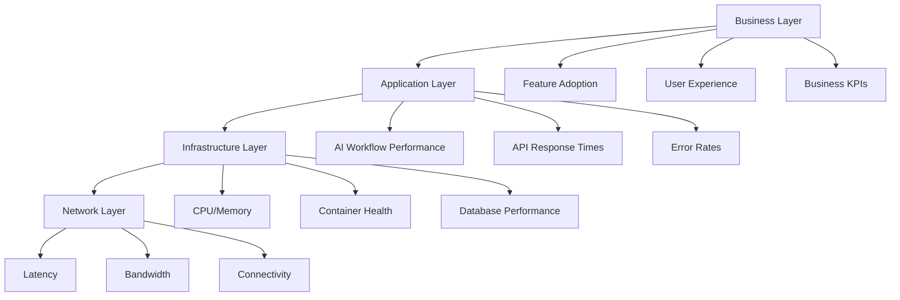

# Monitoring & Observability

> **Automation Memory**: มาตรฐานการติดตาม วิเคราะห์ และปรับปรุงระบบ AI/N8N workflows แบบเรียลไทม์

## Table of Contents
- [Observability Strategy](#observability-strategy)
- [Metrics Collection](#metrics-collection)
- [Logging Standards](#logging-standards)
- [Distributed Tracing](#distributed-tracing)
- [Alerting & Incident Response](#alerting--incident-response)
- [Dashboard & Visualization](#dashboard--visualization)
- [Performance Monitoring](#performance-monitoring)
- [Business Intelligence](#business-intelligence)

---

## Observability Strategy

### **Three Pillars of Observability**
```yaml
1. Metrics (What):
   - Quantitative measurements
   - Performance indicators
   - Business KPIs
   - System health metrics

2. Logs (When/Where):
   - Event details with context
   - Error messages and stack traces
   - Audit trails
   - Correlation IDs

3. Traces (How):
   - Request flow across services
   - Performance bottlenecks
   - Dependency mapping
   - Error propagation
```

### **Monitoring Layers**


### **Data Collection Strategy**
```yaml
Real-time Metrics:
  - Workflow execution status
  - AI response times
  - API performance
  - Error rates and types
  - Resource utilization

Batch Analytics:
  - Daily workflow summaries
  - Quality trend analysis
  - Cost optimization data
  - User behavior patterns
  - Business impact metrics

Historical Data:
  - Long-term performance trends
  - Capacity planning data
  - Seasonal patterns
  - Compliance audit trails
  - Learning pattern evolution
```

---

## Metrics Collection

### **AI Workflow Metrics**
```yaml
# Stage-Level Metrics
workflow_stage_duration_seconds:
  description: "Time taken for each workflow stage"
  labels: [stage, service, environment]
  type: histogram
  buckets: [0.1, 0.5, 1, 5, 10, 30, 60, 300]

workflow_stage_success_rate:
  description: "Success rate by workflow stage"
  labels: [stage, service, environment]
  type: gauge

workflow_ai_tokens_used:
  description: "AI tokens consumed per request"
  labels: [stage, model, service]
  type: counter

workflow_human_intervention_rate:
  description: "Rate of human intervention required"
  labels: [stage, reason, service]
  type: gauge

workflow_quality_score:
  description: "AI output quality score (0-1)"
  labels: [stage, service]
  type: histogram
  buckets: [0.1, 0.2, 0.3, 0.4, 0.5, 0.6, 0.7, 0.8, 0.9, 1.0]

# Business Metrics
features_delivered_total:
  description: "Total features delivered"
  labels: [service, priority, team]
  type: counter

lead_time_seconds:
  description: "Time from issue to production"
  labels: [service, priority]
  type: histogram
  buckets: [3600, 7200, 14400, 28800, 86400, 172800, 604800]

bug_introduction_rate:
  description: "Bugs introduced per deployment"
  labels: [service, stage]
  type: gauge

customer_satisfaction_score:
  description: "Customer satisfaction with new features"
  labels: [service, feature_type]
  type: gauge
```

### **Technical Metrics**
```yaml
# API Performance
api_request_duration_seconds:
  description: "API request duration"
  labels: [method, endpoint, status_code]
  type: histogram

api_requests_total:
  description: "Total API requests"
  labels: [method, endpoint, status_code]
  type: counter

api_error_rate:
  description: "API error rate"
  labels: [endpoint, error_type]
  type: gauge

# System Resources
cpu_usage_percent:
  description: "CPU utilization"
  labels: [service, container]
  type: gauge

memory_usage_bytes:
  description: "Memory usage"
  labels: [service, container]
  type: gauge

disk_usage_percent:
  description: "Disk utilization"
  labels: [service, mount_point]
  type: gauge

# Database Performance
database_query_duration_seconds:
  description: "Database query execution time"
  labels: [operation, collection]
  type: histogram

database_connections_active:
  description: "Active database connections"
  labels: [database, service]
  type: gauge

database_slow_queries_total:
  description: "Number of slow queries"
  labels: [database, collection]
  type: counter
```

### **Metrics Implementation**
```javascript
// Prometheus metrics collection
const prometheus = require('prom-client');

// Create metric instances
const workflowDuration = new prometheus.Histogram({
  name: 'workflow_stage_duration_seconds',
  help: 'Time taken for each workflow stage',
  labelNames: ['stage', 'service', 'environment'],
  buckets: [0.1, 0.5, 1, 5, 10, 30, 60, 300]
});

const workflowSuccess = new prometheus.Gauge({
  name: 'workflow_stage_success_rate',
  help: 'Success rate by workflow stage',
  labelNames: ['stage', 'service', 'environment']
});

const aiTokensUsed = new prometheus.Counter({
  name: 'workflow_ai_tokens_used',
  help: 'AI tokens consumed per request',
  labelNames: ['stage', 'model', 'service']
});

// Workflow metrics collector
class WorkflowMetrics {
  constructor() {
    this.activeWorkflows = new Map();
  }

  startWorkflowStage(workflowId, stage, service) {
    const key = `${workflowId}-${stage}`;
    this.activeWorkflows.set(key, {
      startTime: Date.now(),
      stage,
      service,
      workflowId
    });
  }

  completeWorkflowStage(workflowId, stage, success, metadata = {}) {
    const key = `${workflowId}-${stage}`;
    const workflow = this.activeWorkflows.get(key);

    if (!workflow) {
      console.warn(`No active workflow found for ${key}`);
      return;
    }

    const duration = (Date.now() - workflow.startTime) / 1000;
    const labels = {
      stage: workflow.stage,
      service: workflow.service,
      environment: process.env.NODE_ENV || 'development'
    };

    // Record duration
    workflowDuration.labels(labels).observe(duration);

    // Record success rate
    workflowSuccess.labels(labels).set(success ? 1 : 0);

    // Record AI token usage if provided
    if (metadata.aiTokens) {
      aiTokensUsed.labels({
        stage: workflow.stage,
        model: metadata.model || 'unknown',
        service: workflow.service
      }).inc(metadata.aiTokens);
    }

    // Additional metrics
    if (metadata.qualityScore) {
      qualityScore.labels({
        stage: workflow.stage,
        service: workflow.service
      }).observe(metadata.qualityScore);
    }

    if (metadata.humanIntervention) {
      humanInterventionRate.labels({
        stage: workflow.stage,
        reason: metadata.interventionReason || 'unknown',
        service: workflow.service
      }).inc();
    }

    this.activeWorkflows.delete(key);
  }

  recordBusinessMetric(metricName, value, labels = {}) {
    switch (metricName) {
      case 'feature_delivered':
        featuresDelivered.labels(labels).inc();
        break;
      case 'lead_time':
        leadTime.labels(labels).observe(value);
        break;
      case 'customer_satisfaction':
        customerSatisfaction.labels(labels).set(value);
        break;
    }
  }
}

// Usage in N8N workflows
const metrics = new WorkflowMetrics();

// In workflow start
metrics.startWorkflowStage('workflow-123', 'intake', 'catalog');

// In workflow completion
metrics.completeWorkflowStage('workflow-123', 'intake', true, {
  aiTokens: 1500,
  qualityScore: 0.92,
  model: 'gpt-4'
});
```

---

## Logging Standards

### **Structured Logging Format**
```json
{
  "timestamp": "2025-09-16T10:30:00.123Z",
  "level": "info",
  "service": "n8n-workflow",
  "workflow_id": "workflow-123",
  "stage": "contract-draft",
  "correlation_id": "req_abc123",
  "user_id": "user_456",
  "event": "ai_response_received",
  "message": "AI successfully generated OpenAPI specification",
  "context": {
    "ai_model": "gpt-4-turbo",
    "tokens_used": 1500,
    "response_time_ms": 2300,
    "quality_score": 0.92
  },
  "metadata": {
    "service_name": "catalog",
    "issue_id": "issue_789",
    "pr_url": "https://github.com/tanqory/catalog-repo/pull/123"
  }
}
```

### **Log Levels & Usage**
```yaml
FATAL (0):
  - System crashes
  - Data corruption
  - Security breaches
  - Unrecoverable errors

ERROR (1):
  - Workflow stage failures
  - AI service errors
  - Integration failures
  - Business rule violations

WARN (2):
  - Quality gate warnings
  - Performance degradation
  - Retry attempts
  - Configuration issues

INFO (3):
  - Workflow stage completions
  - Successful operations
  - Business events
  - System state changes

DEBUG (4):
  - AI prompts and responses
  - Detailed execution flow
  - Variable values
  - Performance timings

TRACE (5):
  - Function entry/exit
  - Variable state changes
  - Detailed debugging
  - Development only
```

### **Logging Implementation**
```javascript
// Winston logger configuration
const winston = require('winston');
const { ElasticsearchTransport } = require('winston-elasticsearch');

// Create logger with multiple transports
const logger = winston.createLogger({
  level: process.env.LOG_LEVEL || 'info',
  format: winston.format.combine(
    winston.format.timestamp(),
    winston.format.errors({ stack: true }),
    winston.format.json(),
    winston.format.printf(({ timestamp, level, message, ...meta }) => {
      return JSON.stringify({
        timestamp,
        level,
        service: process.env.SERVICE_NAME || 'n8n-workflow',
        message,
        ...meta
      });
    })
  ),
  defaultMeta: {
    service: process.env.SERVICE_NAME || 'n8n-workflow',
    version: process.env.SERVICE_VERSION || '1.0.0',
    environment: process.env.NODE_ENV || 'development'
  },
  transports: [
    // Console output
    new winston.transports.Console({
      format: winston.format.combine(
        winston.format.colorize(),
        winston.format.simple()
      )
    }),

    // File output for errors
    new winston.transports.File({
      filename: 'logs/error.log',
      level: 'error',
      maxsize: 50 * 1024 * 1024, // 50MB
      maxFiles: 5
    }),

    // Elasticsearch for centralized logging
    new ElasticsearchTransport({
      level: 'info',
      clientOpts: {
        node: process.env.ELASTICSEARCH_URL
      },
      index: 'tanqory-workflows'
    })
  ]
});

// Workflow logger wrapper
class WorkflowLogger {
  constructor(workflowId, stage, service) {
    this.workflowId = workflowId;
    this.stage = stage;
    this.service = service;
    this.correlationId = this.generateCorrelationId();
  }

  generateCorrelationId() {
    return `${this.service}-${this.stage}-${Date.now()}-${Math.random().toString(36).substr(2, 9)}`;
  }

  log(level, event, message, context = {}, metadata = {}) {
    logger.log(level, message, {
      workflow_id: this.workflowId,
      stage: this.stage,
      correlation_id: this.correlationId,
      event: event,
      context: context,
      metadata: {
        service_name: this.service,
        ...metadata
      }
    });
  }

  info(event, message, context, metadata) {
    this.log('info', event, message, context, metadata);
  }

  error(event, message, error, context, metadata) {
    this.log('error', event, message, {
      error: {
        message: error.message,
        stack: error.stack,
        name: error.name
      },
      ...context
    }, metadata);
  }

  warn(event, message, context, metadata) {
    this.log('warn', event, message, context, metadata);
  }

  debug(event, message, context, metadata) {
    this.log('debug', event, message, context, metadata);
  }

  // Workflow-specific logging methods
  logAIRequest(prompt, model) {
    this.info('ai_request_sent', 'AI request initiated', {
      ai_model: model,
      prompt_length: prompt.length,
      timestamp: new Date().toISOString()
    });
  }

  logAIResponse(response, metrics) {
    this.info('ai_response_received', 'AI response processed', {
      response_length: response.length,
      tokens_used: metrics.tokensUsed,
      response_time_ms: metrics.responseTime,
      quality_score: metrics.qualityScore
    });
  }

  logQualityGate(gateName, passed, score, details) {
    this.info('quality_gate_checked', `Quality gate ${gateName} ${passed ? 'passed' : 'failed'}`, {
      gate_name: gateName,
      passed: passed,
      score: score,
      details: details
    });
  }

  logHumanEscalation(reason, expert, context) {
    this.warn('human_escalation', 'Workflow escalated to human expert', {
      escalation_reason: reason,
      assigned_expert: expert,
      escalation_context: context
    });
  }
}

// Usage in N8N workflows
const workflowLogger = new WorkflowLogger('workflow-123', 'contract-draft', 'catalog');

// Log AI interaction
workflowLogger.logAIRequest(aiPrompt, 'gpt-4-turbo');
workflowLogger.logAIResponse(aiResponse, {
  tokensUsed: 1500,
  responseTime: 2300,
  qualityScore: 0.92
});

// Log quality gates
workflowLogger.logQualityGate('syntax_validation', true, 0.95, {
  errors_found: 0,
  warnings: 2
});
```

---

## Distributed Tracing

### **Trace Structure**
```yaml
Trace Hierarchy:
  - Span: Workflow (entire workflow execution)
    - Span: Stage (each workflow stage)
      - Span: AI Request (AI service call)
      - Span: Validation (output validation)
      - Span: Quality Gates (quality checks)
      - Span: GitHub API (repository operations)
      - Span: Slack Notification (notifications)
```

### **OpenTelemetry Implementation**
```javascript
// OpenTelemetry setup
const { NodeSDK } = require('@opentelemetry/auto-instrumentations-node');
const { Resource } = require('@opentelemetry/resources');
const { SemanticResourceAttributes } = require('@opentelemetry/semantic-conventions');
const { JaegerExporter } = require('@opentelemetry/exporter-jaeger');
const { getNodeAutoInstrumentations } = require('@opentelemetry/auto-instrumentations-node');

// Initialize tracing
const traceExporter = new JaegerExporter({
  endpoint: process.env.JAEGER_ENDPOINT || 'http://localhost:14268/api/traces',
});

const sdk = new NodeSDK({
  resource: new Resource({
    [SemanticResourceAttributes.SERVICE_NAME]: 'tanqory-workflows',
    [SemanticResourceAttributes.SERVICE_VERSION]: '1.0.0',
    [SemanticResourceAttributes.DEPLOYMENT_ENVIRONMENT]: process.env.NODE_ENV || 'development'
  }),
  traceExporter: traceExporter,
  instrumentations: [getNodeAutoInstrumentations()]
});

sdk.start();

// Workflow tracing
const { trace, context } = require('@opentelemetry/api');

class WorkflowTracer {
  constructor(workflowId, service) {
    this.tracer = trace.getTracer('tanqory-workflows');
    this.workflowId = workflowId;
    this.service = service;
    this.activeSpans = new Map();
  }

  startWorkflow(issueId, priority) {
    const span = this.tracer.startSpan(`workflow:${this.service}`, {
      attributes: {
        'workflow.id': this.workflowId,
        'workflow.service': this.service,
        'workflow.issue_id': issueId,
        'workflow.priority': priority,
        'workflow.start_time': Date.now()
      }
    });

    this.activeSpans.set('workflow', span);
    return span;
  }

  startStage(stageName, stageData = {}) {
    const workflowSpan = this.activeSpans.get('workflow');

    const span = this.tracer.startSpan(`stage:${stageName}`, {
      parent: workflowSpan,
      attributes: {
        'stage.name': stageName,
        'stage.service': this.service,
        'stage.workflow_id': this.workflowId,
        'stage.start_time': Date.now(),
        ...stageData
      }
    });

    this.activeSpans.set(`stage:${stageName}`, span);
    return span;
  }

  startAIRequest(stageName, model, promptLength) {
    const stageSpan = this.activeSpans.get(`stage:${stageName}`);

    const span = this.tracer.startSpan('ai:request', {
      parent: stageSpan,
      attributes: {
        'ai.model': model,
        'ai.prompt_length': promptLength,
        'ai.stage': stageName,
        'ai.service': this.service
      }
    });

    this.activeSpans.set(`ai:${stageName}`, span);
    return span;
  }

  completeAIRequest(stageName, success, metrics) {
    const span = this.activeSpans.get(`ai:${stageName}`);

    if (span) {
      span.setAttributes({
        'ai.success': success,
        'ai.tokens_used': metrics.tokensUsed || 0,
        'ai.response_time_ms': metrics.responseTime || 0,
        'ai.quality_score': metrics.qualityScore || 0,
        'ai.response_length': metrics.responseLength || 0
      });

      if (!success && metrics.error) {
        span.recordException(metrics.error);
        span.setStatus({
          code: trace.SpanStatusCode.ERROR,
          message: metrics.error.message
        });
      }

      span.end();
      this.activeSpans.delete(`ai:${stageName}`);
    }
  }

  addEvent(spanKey, eventName, attributes = {}) {
    const span = this.activeSpans.get(spanKey);
    if (span) {
      span.addEvent(eventName, {
        timestamp: Date.now(),
        ...attributes
      });
    }
  }

  completeStage(stageName, success, metadata = {}) {
    const span = this.activeSpans.get(`stage:${stageName}`);

    if (span) {
      span.setAttributes({
        'stage.success': success,
        'stage.end_time': Date.now(),
        'stage.duration_ms': Date.now() - span.attributes['stage.start_time'],
        ...metadata
      });

      if (!success && metadata.error) {
        span.recordException(metadata.error);
        span.setStatus({
          code: trace.SpanStatusCode.ERROR,
          message: metadata.error.message
        });
      }

      span.end();
      this.activeSpans.delete(`stage:${stageName}`);
    }
  }

  completeWorkflow(success, summary = {}) {
    const span = this.activeSpans.get('workflow');

    if (span) {
      span.setAttributes({
        'workflow.success': success,
        'workflow.end_time': Date.now(),
        'workflow.duration_ms': Date.now() - span.attributes['workflow.start_time'],
        'workflow.stages_completed': summary.stagesCompleted || 0,
        'workflow.quality_score': summary.overallQualityScore || 0,
        'workflow.human_interventions': summary.humanInterventions || 0
      });

      if (!success && summary.error) {
        span.recordException(summary.error);
        span.setStatus({
          code: trace.SpanStatusCode.ERROR,
          message: summary.error.message
        });
      }

      span.end();
      this.activeSpans.delete('workflow');
    }
  }
}

// Usage in N8N workflows
const tracer = new WorkflowTracer('workflow-123', 'catalog');

// Start workflow trace
const workflowSpan = tracer.startWorkflow('issue-456', 'high');

// Start stage trace
const stageSpan = tracer.startStage('contract-draft', {
  'stage.input_type': 'github_issue',
  'stage.expected_output': 'openapi_spec'
});

// Trace AI request
tracer.startAIRequest('contract-draft', 'gpt-4-turbo', promptText.length);

// Complete AI request
tracer.completeAIRequest('contract-draft', true, {
  tokensUsed: 1500,
  responseTime: 2300,
  qualityScore: 0.92,
  responseLength: aiResponse.length
});

// Add events
tracer.addEvent('stage:contract-draft', 'validation_started', {
  'validation.type': 'openapi_schema'
});

tracer.addEvent('stage:contract-draft', 'quality_gate_passed', {
  'quality.gate': 'syntax_validation',
  'quality.score': 0.95
});

// Complete stage
tracer.completeStage('contract-draft', true, {
  'stage.output_size': outputData.length,
  'stage.quality_score': 0.92
});

// Complete workflow
tracer.completeWorkflow(true, {
  stagesCompleted: 5,
  overallQualityScore: 0.89,
  humanInterventions: 0
});
```

---

## Alerting & Incident Response

### **Alert Severity Levels**
```yaml
CRITICAL (P0):
  - Production system down
  - Data corruption detected
  - Security breach
  - Multiple workflow stages failing
  Response Time: 15 minutes
  Escalation: Immediate to on-call engineer

HIGH (P1):
  - AI service unavailable
  - Quality gate failures >20%
  - Performance degradation >50%
  - Single workflow stage failing consistently
  Response Time: 1 hour
  Escalation: To service owner

MEDIUM (P2):
  - Quality scores declining
  - Increased human intervention rate
  - Resource utilization warnings
  - Integration service issues
  Response Time: 4 hours
  Escalation: To team lead

LOW (P3):
  - Documentation updates needed
  - Performance optimizations
  - Process improvements
  - Monitoring gaps
  Response Time: 24 hours
  Escalation: To product owner
```

### **Alert Rules Configuration**
```yaml
# Prometheus Alert Rules
groups:
  - name: tanqory-workflows
    rules:
      # Workflow Performance
      - alert: WorkflowStageDurationHigh
        expr: histogram_quantile(0.95, workflow_stage_duration_seconds) > 300
        for: 5m
        labels:
          severity: warning
          team: platform
        annotations:
          summary: "Workflow stage taking too long"
          description: "Stage {{ $labels.stage }} for service {{ $labels.service }} is taking more than 5 minutes"

      - alert: WorkflowFailureRateHigh
        expr: (1 - workflow_stage_success_rate) > 0.2
        for: 2m
        labels:
          severity: critical
          team: platform
        annotations:
          summary: "High workflow failure rate"
          description: "Workflow failure rate is {{ $value | humanizePercentage }} for stage {{ $labels.stage }}"

      # AI Performance
      - alert: AIServiceUnavailable
        expr: up{job="ai-service"} == 0
        for: 1m
        labels:
          severity: critical
          team: ai
        annotations:
          summary: "AI service is down"
          description: "AI service has been unavailable for more than 1 minute"

      - alert: AITokenUsageHigh
        expr: rate(workflow_ai_tokens_used[5m]) > 1000
        for: 5m
        labels:
          severity: warning
          team: ai
        annotations:
          summary: "High AI token usage"
          description: "AI token usage rate is {{ $value }} tokens/second"

      # Quality Metrics
      - alert: QualityScoreLow
        expr: avg_over_time(workflow_quality_score[30m]) < 0.7
        for: 10m
        labels:
          severity: warning
          team: quality
        annotations:
          summary: "Low workflow quality scores"
          description: "Average quality score has been below 0.7 for 30 minutes"

      - alert: HumanInterventionRateHigh
        expr: workflow_human_intervention_rate > 0.3
        for: 15m
        labels:
          severity: warning
          team: platform
        annotations:
          summary: "High human intervention rate"
          description: "Human intervention rate is {{ $value | humanizePercentage }}"

      # Business Metrics
      - alert: LeadTimeIncreasing
        expr: avg_over_time(lead_time_seconds[1h]) > 86400
        for: 30m
        labels:
          severity: warning
          team: product
        annotations:
          summary: "Lead time increasing"
          description: "Average lead time has exceeded 24 hours"

      # System Resources
      - alert: HighCPUUsage
        expr: cpu_usage_percent > 80
        for: 5m
        labels:
          severity: warning
          team: infrastructure
        annotations:
          summary: "High CPU usage"
          description: "CPU usage is {{ $value }}% on {{ $labels.instance }}"

      - alert: HighMemoryUsage
        expr: memory_usage_bytes / memory_total_bytes > 0.9
        for: 5m
        labels:
          severity: critical
          team: infrastructure
        annotations:
          summary: "High memory usage"
          description: "Memory usage is {{ $value | humanizePercentage }} on {{ $labels.instance }}"
```

### **Incident Response Automation**
```javascript
// Automated incident response
class IncidentResponse {
  constructor() {
    this.alertHandlers = new Map();
    this.escalationPolicies = new Map();
    this.setupHandlers();
  }

  setupHandlers() {
    // Workflow failure handler
    this.alertHandlers.set('WorkflowFailureRateHigh', async (alert) => {
      await this.handleWorkflowFailures(alert);
    });

    // AI service handler
    this.alertHandlers.set('AIServiceUnavailable', async (alert) => {
      await this.handleAIServiceDown(alert);
    });

    // Quality degradation handler
    this.alertHandlers.set('QualityScoreLow', async (alert) => {
      await this.handleQualityDegradation(alert);
    });
  }

  async handleWorkflowFailures(alert) {
    const stage = alert.labels.stage;
    const service = alert.labels.service;

    // Gather diagnostic information
    const diagnostics = await this.gatherDiagnostics(stage, service);

    // Attempt automatic remediation
    const remediation = await this.attemptRemediation(diagnostics);

    if (remediation.success) {
      await this.notifyResolution(alert, remediation);
    } else {
      await this.escalateIncident(alert, diagnostics);
    }
  }

  async handleAIServiceDown(alert) {
    // Check if backup AI service is available
    const backupAvailable = await this.checkBackupAIService();

    if (backupAvailable) {
      // Switch to backup service
      await this.switchToBackupAI();
      await this.notifyServiceSwitch(alert);
    } else {
      // Escalate immediately
      await this.escalateIncident(alert, {
        priority: 'P0',
        reason: 'No backup AI service available'
      });
    }
  }

  async handleQualityDegradation(alert) {
    // Analyze recent quality trends
    const qualityAnalysis = await this.analyzeQualityTrends();

    // Generate recommendations
    const recommendations = await this.generateQualityRecommendations(qualityAnalysis);

    // Notify relevant teams
    await this.notifyQualityTeam(alert, recommendations);

    // Schedule quality review meeting if needed
    if (qualityAnalysis.severity > 0.5) {
      await this.scheduleQualityReview(qualityAnalysis);
    }
  }

  async gatherDiagnostics(stage, service) {
    return {
      recentLogs: await this.getRecentLogs(stage, service),
      metrics: await this.getMetrics(stage, service),
      traces: await this.getTraces(stage, service),
      systemHealth: await this.getSystemHealth(),
      relatedIncidents: await this.getRelatedIncidents(stage, service)
    };
  }

  async attemptRemediation(diagnostics) {
    const commonIssues = [
      { pattern: /timeout/i, action: 'increase_timeout' },
      { pattern: /rate.limit/i, action: 'reduce_request_rate' },
      { pattern: /memory/i, action: 'restart_service' },
      { pattern: /disk.space/i, action: 'cleanup_logs' }
    ];

    for (const issue of commonIssues) {
      if (issue.pattern.test(JSON.stringify(diagnostics))) {
        const result = await this.executeRemediation(issue.action, diagnostics);
        if (result.success) {
          return result;
        }
      }
    }

    return { success: false, reason: 'No automatic remediation available' };
  }

  async escalateIncident(alert, context) {
    const incident = {
      id: this.generateIncidentId(),
      title: alert.annotations.summary,
      description: alert.annotations.description,
      severity: alert.labels.severity,
      team: alert.labels.team,
      context: context,
      createdAt: new Date().toISOString()
    };

    // Create incident in management system
    await this.createIncident(incident);

    // Notify on-call engineer
    await this.notifyOnCall(incident);

    // Create war room if critical
    if (incident.severity === 'critical') {
      await this.createWarRoom(incident);
    }

    return incident;
  }
}

// PagerDuty integration
class PagerDutyIntegration {
  constructor(apiKey, serviceKey) {
    this.apiKey = apiKey;
    this.serviceKey = serviceKey;
  }

  async createAlert(alert) {
    const payload = {
      routing_key: this.serviceKey,
      event_action: 'trigger',
      dedup_key: this.generateDedupKey(alert),
      payload: {
        summary: alert.annotations.summary,
        severity: this.mapSeverity(alert.labels.severity),
        source: 'tanqory-workflows',
        component: alert.labels.service,
        group: alert.labels.team,
        class: alert.labels.alertname,
        custom_details: {
          stage: alert.labels.stage,
          service: alert.labels.service,
          environment: alert.labels.environment,
          description: alert.annotations.description,
          runbook_url: this.getRunbookUrl(alert.labels.alertname)
        }
      }
    };

    return await this.sendToPagerDuty(payload);
  }

  async resolveAlert(alert) {
    const payload = {
      routing_key: this.serviceKey,
      event_action: 'resolve',
      dedup_key: this.generateDedupKey(alert)
    };

    return await this.sendToPagerDuty(payload);
  }

  generateDedupKey(alert) {
    return `${alert.labels.alertname}-${alert.labels.service}-${alert.labels.stage}`;
  }

  mapSeverity(prometheusLevel) {
    const mapping = {
      'critical': 'critical',
      'warning': 'warning',
      'info': 'info'
    };
    return mapping[prometheusLevel] || 'warning';
  }

  getRunbookUrl(alertName) {
    return `https://docs.tanqory.com/runbooks/${alertName.toLowerCase()}`;
  }

  async sendToPagerDuty(payload) {
    return await fetch('https://events.pagerduty.com/v2/enqueue', {
      method: 'POST',
      headers: {
        'Content-Type': 'application/json',
        'Authorization': `Token token=${this.apiKey}`
      },
      body: JSON.stringify(payload)
    });
  }
}
```

---

## Dashboard & Visualization

### **Executive Dashboard**
```yaml
# High-level business metrics
Metrics Displayed:
  - Features delivered this week/month
  - Average lead time trend
  - Customer satisfaction scores
  - ROI from AI automation
  - Team productivity metrics

Refresh Rate: 15 minutes
Access: C-level executives, product managers
URL: https://dashboards.tanqory.com/executive
```

### **Engineering Dashboard**
```yaml
# Technical metrics for engineering teams
Metrics Displayed:
  - Workflow success rates by stage
  - AI service performance
  - Quality scores and trends
  - Resource utilization
  - Error rates and patterns

Refresh Rate: 1 minute
Access: Engineering teams, DevOps
URL: https://dashboards.tanqory.com/engineering
```

### **Operations Dashboard**
```yaml
# Real-time operational metrics
Metrics Displayed:
  - Active workflows count
  - Current system health
  - Recent alerts and incidents
  - Performance bottlenecks
  - Capacity utilization

Refresh Rate: 30 seconds
Access: Operations team, on-call engineers
URL: https://dashboards.tanqory.com/operations
```

### **Grafana Dashboard Configuration**
```json
{
  "dashboard": {
    "title": "Tanqory AI Workflows - Engineering",
    "tags": ["tanqory", "workflows", "ai"],
    "timezone": "browser",
    "refresh": "1m",
    "panels": [
      {
        "title": "Workflow Success Rate",
        "type": "stat",
        "targets": [
          {
            "expr": "avg(workflow_stage_success_rate)",
            "legendFormat": "Overall Success Rate"
          }
        ],
        "fieldConfig": {
          "defaults": {
            "unit": "percentunit",
            "min": 0,
            "max": 1,
            "thresholds": {
              "steps": [
                { "color": "red", "value": 0 },
                { "color": "yellow", "value": 0.8 },
                { "color": "green", "value": 0.9 }
              ]
            }
          }
        }
      },
      {
        "title": "Workflow Duration by Stage",
        "type": "bargauge",
        "targets": [
          {
            "expr": "histogram_quantile(0.95, rate(workflow_stage_duration_seconds_bucket[5m])) by (stage)",
            "legendFormat": "{{stage}}"
          }
        ],
        "fieldConfig": {
          "defaults": {
            "unit": "s",
            "thresholds": {
              "steps": [
                { "color": "green", "value": 0 },
                { "color": "yellow", "value": 60 },
                { "color": "red", "value": 300 }
              ]
            }
          }
        }
      },
      {
        "title": "AI Token Usage Rate",
        "type": "timeseries",
        "targets": [
          {
            "expr": "rate(workflow_ai_tokens_used[5m])",
            "legendFormat": "Tokens/sec"
          }
        ],
        "fieldConfig": {
          "defaults": {
            "unit": "reqps"
          }
        }
      },
      {
        "title": "Quality Score Distribution",
        "type": "histogram",
        "targets": [
          {
            "expr": "workflow_quality_score",
            "legendFormat": "Quality Score"
          }
        ],
        "fieldConfig": {
          "defaults": {
            "unit": "short",
            "min": 0,
            "max": 1
          }
        }
      },
      {
        "title": "Human Intervention Rate",
        "type": "timeseries",
        "targets": [
          {
            "expr": "workflow_human_intervention_rate by (reason)",
            "legendFormat": "{{reason}}"
          }
        ],
        "fieldConfig": {
          "defaults": {
            "unit": "percentunit"
          }
        }
      },
      {
        "title": "Recent Workflow Events",
        "type": "logs",
        "targets": [
          {
            "expr": "{service=\"n8n-workflow\"} |= \"workflow\" | json",
            "legendFormat": "Workflow Logs"
          }
        ]
      }
    ]
  }
}
```

---

## Performance Monitoring

### **Enterprise Service Level Agreements (SLAs)**

#### **Tier 1 - Critical Services (Revenue Impact)**
```yaml
Payment_Services:
  Availability: 99.95% uptime (21.6 min/month downtime)
  Response_Time: <150ms (P95), <300ms (P99)
  Error_Rate: <0.01% for payment processing
  Recovery_Time: <5 minutes for critical failures
  Business_Impact: Direct revenue loss
  Financial_Penalty: $1,000/minute downtime

Authentication_Services:
  Availability: 99.9% uptime (43.2 min/month downtime)
  Response_Time: <200ms (P95), <500ms (P99)
  Error_Rate: <0.1% for login attempts
  Recovery_Time: <10 minutes for authentication failures
  Business_Impact: User access blocked
  Financial_Penalty: $500/minute downtime

Catalog_Services:
  Availability: 99.5% uptime (3.6 hours/month downtime)
  Response_Time: <300ms (P95), <800ms (P99)
  Error_Rate: <0.5% for product queries
  Recovery_Time: <15 minutes for service restoration
  Business_Impact: Shopping experience degraded
  Financial_Penalty: $200/minute downtime
```

#### **Tier 2 - Standard Services (Business Operations)**
```yaml
Notification_Services:
  Availability: 99.0% uptime (7.2 hours/month downtime)
  Response_Time: <500ms (P95), <1500ms (P99)
  Error_Rate: <1% for notification delivery
  Recovery_Time: <30 minutes for service restoration
  Business_Impact: Communication delayed
  Financial_Penalty: $50/minute downtime

Analytics_Services:
  Availability: 98.5% uptime (10.8 hours/month downtime)
  Response_Time: <1000ms (P95), <3000ms (P99)
  Error_Rate: <2% for data queries
  Recovery_Time: <60 minutes for service restoration
  Business_Impact: Business intelligence delayed
  Financial_Penalty: $25/minute downtime

Recommendation_Services:
  Availability: 98.0% uptime (14.4 hours/month downtime)
  Response_Time: <800ms (P95), <2000ms (P99)
  Error_Rate: <3% for recommendation generation
  Recovery_Time: <45 minutes for service restoration
  Business_Impact: Personalization reduced
  Financial_Penalty: $10/minute downtime
```

#### **Global Performance SLAs by Region**
```yaml
Americas:
  US_East: <100ms latency from New York
  US_West: <120ms latency from Los Angeles
  Canada: <150ms latency from Toronto
  Brazil: <200ms latency from São Paulo
  Mexico: <180ms latency from Mexico City

Europe:
  UK: <80ms latency from London
  Germany: <90ms latency from Frankfurt
  France: <100ms latency from Paris
  Netherlands: <85ms latency from Amsterdam
  Spain: <110ms latency from Madrid

Asia_Pacific:
  Japan: <50ms latency from Tokyo
  Singapore: <60ms latency from Singapore
  Australia: <120ms latency from Sydney
  Thailand: <80ms latency from Bangkok
  Korea: <70ms latency from Seoul
  India: <150ms latency from Mumbai

Middle_East_Africa:
  UAE: <100ms latency from Dubai
  Saudi_Arabia: <120ms latency from Riyadh
  South_Africa: <200ms latency from Cape Town
```

#### **Scalability SLAs**
```yaml
Auto_Scaling_Response:
  Scale_Up_Time: <2 minutes for 100% traffic increase
  Scale_Down_Time: <5 minutes for 50% traffic decrease
  Maximum_Capacity: 100x baseline capacity
  Minimum_Capacity: 2x baseline for redundancy

Load_Handling:
  Peak_Traffic: 10x normal load without degradation
  Black_Friday: 50x normal load with <5% degradation
  Flash_Sales: 20x normal load with <2% degradation
  Sustained_High_Load: 5x normal load for 24+ hours

Database_Scaling:
  Read_Replicas: <30 seconds provisioning
  Write_Scaling: <60 seconds for sharding
  Connection_Pool: Auto-scale 10-1000 connections
  Query_Performance: Maintain <100ms P95 under 10x load
```

### **AI Workflow Performance Targets**
```yaml
Workflow Performance Targets:
  Stage 0 (Intake): < 30 seconds (P95), < 60 seconds (P99)
  Stage 1 (Contract): < 5 minutes (P95), < 10 minutes (P99)
  Stage 2 (Implementation): < 30 minutes (P95), < 45 minutes (P99)
  Stage 3 (SDK): < 10 minutes (P95), < 15 minutes (P99)
  Stage 4 (App Integration): < 15 minutes (P95), < 25 minutes (P99)
  Stage 5 (Documentation): < 5 minutes (P95), < 8 minutes (P99)
  Overall Lead Time: < 2 hours (P95), < 3 hours (P99)

AI Service Performance:
  Response Time: < 3 seconds (P95), < 5 seconds (P99)
  Token Usage: < 2000 tokens per request (average)
  Error Rate: < 0.5% (critical), < 1% (standard)
  Availability: > 99.9% (critical), > 99.5% (standard)
  Throughput: > 1000 requests/second peak capacity

System Performance:
  CPU Usage: < 70% average, < 90% peak for <5 minutes
  Memory Usage: < 80% average, < 95% peak for <1 minute
  Disk Usage: < 85% capacity with auto-expansion
  Network Latency: < 50ms (intra-region), < 200ms (cross-region)
```

### **Financial Performance SLAs**
```yaml
Revenue_Protection:
  Transaction_Success_Rate: >99.9%
  Payment_Latency: <2 seconds end-to-end
  Fraud_Detection: <100ms response time
  Refund_Processing: <1 hour completion
  Revenue_At_Risk: <$10,000/minute during outages

Order_Management:
  Order_Placement: <5 seconds completion
  Inventory_Updates: <1 second consistency
  Order_Confirmation: <10 seconds delivery
  Cancellation_Processing: <30 seconds
  Lost_Revenue_Rate: <0.1% of total transactions

Financial_Reporting:
  Real_Time_Revenue: <5 minutes delay
  Financial_Dashboard: <30 seconds refresh
  Audit_Trail: <1 second logging latency
  Reconciliation: <15 minutes for daily close
  Compliance_Reporting: <1 hour for regulatory data
```

### **Performance Testing**
```javascript
// Automated performance testing
class PerformanceTestSuite {
  constructor() {
    this.tests = new Map();
    this.setupTests();
  }

  setupTests() {
    // Workflow stage performance tests
    this.tests.set('stage_performance', async () => {
      return await this.testStagePerformance();
    });

    // AI service load tests
    this.tests.set('ai_load_test', async () => {
      return await this.testAIServiceLoad();
    });

    // End-to-end workflow tests
    this.tests.set('e2e_performance', async () => {
      return await this.testEndToEndPerformance();
    });
  }

  async testStagePerformance() {
    const stages = ['intake', 'contract', 'implementation', 'sdk', 'app', 'docs'];
    const results = [];

    for (const stage of stages) {
      const startTime = Date.now();

      try {
        await this.simulateStage(stage);
        const duration = Date.now() - startTime;

        results.push({
          stage: stage,
          duration: duration,
          success: true,
          withinTarget: this.checkPerformanceTarget(stage, duration)
        });
      } catch (error) {
        results.push({
          stage: stage,
          duration: Date.now() - startTime,
          success: false,
          error: error.message
        });
      }
    }

    return results;
  }

  async testAIServiceLoad() {
    const concurrentRequests = 10;
    const requestsPerTest = 100;
    const results = [];

    // Test concurrent AI requests
    for (let batch = 0; batch < requestsPerTest / concurrentRequests; batch++) {
      const promises = [];

      for (let i = 0; i < concurrentRequests; i++) {
        promises.push(this.makeAIRequest());
      }

      const batchResults = await Promise.allSettled(promises);
      results.push(...batchResults.map(result => ({
        success: result.status === 'fulfilled',
        duration: result.value?.duration || 0,
        error: result.reason?.message
      })));
    }

    return this.analyzeLoadTestResults(results);
  }

  async testEndToEndPerformance() {
    const testIssue = {
      title: "Performance test feature",
      body: "Add new API endpoint for testing",
      labels: ["domain:catalog", "type:feature", "priority:medium"]
    };

    const startTime = Date.now();

    try {
      const result = await this.simulateFullWorkflow(testIssue);
      const totalDuration = Date.now() - startTime;

      return {
        success: true,
        totalDuration: totalDuration,
        stageBreakdown: result.stageTimings,
        qualityScore: result.qualityScore,
        withinTarget: totalDuration < 7200000 // 2 hours
      };
    } catch (error) {
      return {
        success: false,
        totalDuration: Date.now() - startTime,
        error: error.message
      };
    }
  }

  checkPerformanceTarget(stage, duration) {
    const targets = {
      intake: 30000,      // 30 seconds
      contract: 300000,   // 5 minutes
      implementation: 1800000, // 30 minutes
      sdk: 600000,        // 10 minutes
      app: 900000,        // 15 minutes
      docs: 300000        // 5 minutes
    };

    return duration <= targets[stage];
  }

  async simulateStage(stage) {
    // Simulate stage execution with mock data
    const mockData = this.generateMockData(stage);
    return await this.executeStageLogic(stage, mockData);
  }

  async makeAIRequest() {
    const startTime = Date.now();

    try {
      const response = await fetch(process.env.AI_SERVICE_URL, {
        method: 'POST',
        headers: { 'Content-Type': 'application/json' },
        body: JSON.stringify({
          prompt: "Generate a simple API endpoint",
          model: "gpt-4-turbo"
        })
      });

      const duration = Date.now() - startTime;
      return { duration, success: response.ok };
    } catch (error) {
      throw new Error(`AI request failed: ${error.message}`);
    }
  }

  analyzeLoadTestResults(results) {
    const successful = results.filter(r => r.success);
    const failed = results.filter(r => !r.success);
    const durations = successful.map(r => r.duration);

    return {
      totalRequests: results.length,
      successfulRequests: successful.length,
      failedRequests: failed.length,
      successRate: successful.length / results.length,
      averageDuration: durations.reduce((a, b) => a + b, 0) / durations.length,
      p95Duration: this.percentile(durations, 0.95),
      p99Duration: this.percentile(durations, 0.99),
      maxDuration: Math.max(...durations),
      minDuration: Math.min(...durations)
    };
  }

  percentile(arr, p) {
    const sorted = arr.sort((a, b) => a - b);
    const index = Math.ceil(sorted.length * p) - 1;
    return sorted[index];
  }
}

// Scheduled performance testing
const performanceTests = new PerformanceTestSuite();

// Run tests every hour
setInterval(async () => {
  try {
    const results = await performanceTests.runAllTests();

    // Send results to monitoring system
    await sendPerformanceMetrics(results);

    // Alert if performance degrades
    if (results.some(r => !r.success || !r.withinTarget)) {
      await alertPerformanceDegradation(results);
    }
  } catch (error) {
    console.error('Performance test failed:', error);
  }
}, 3600000); // 1 hour
```

---

## Business Intelligence

### **Business Metrics Dashboard**
```yaml
KPI Tracking:
  - Developer Productivity: Features per developer per week
  - Time to Market: Idea to production lead time
  - Quality Metrics: Bug rate, customer satisfaction
  - Cost Efficiency: Cost per feature, ROI of automation
  - Team Performance: Sprint velocity, story completion rate

Data Sources:
  - GitHub (commits, PRs, issues)
  - Jira/Linear (story tracking)
  - Customer feedback systems
  - Cost management tools
  - HR systems (team composition)

Reporting Schedule:
  - Daily: Operational metrics
  - Weekly: Team performance
  - Monthly: Business KPIs
  - Quarterly: Strategic analysis
```

### **Analytics Implementation**
```javascript
// Business intelligence data collection
class BusinessIntelligence {
  constructor() {
    this.dataWarehouse = new DataWarehouse();
    this.metrics = new MetricsCalculator();
  }

  async collectDailyMetrics() {
    const today = new Date().toISOString().split('T')[0];

    const data = {
      date: today,
      workflows: await this.getWorkflowMetrics(today),
      development: await this.getDevelopmentMetrics(today),
      quality: await this.getQualityMetrics(today),
      business: await this.getBusinessMetrics(today)
    };

    await this.dataWarehouse.store('daily_metrics', data);
    return data;
  }

  async getWorkflowMetrics(date) {
    return {
      totalWorkflowsStarted: await this.countWorkflows(date, 'started'),
      totalWorkflowsCompleted: await this.countWorkflows(date, 'completed'),
      averageLeadTime: await this.calculateAverageLeadTime(date),
      successRate: await this.calculateSuccessRate(date),
      humanInterventionRate: await this.calculateHumanInterventionRate(date),
      aiTokensUsed: await this.getTotalAITokens(date),
      costSavings: await this.calculateCostSavings(date)
    };
  }

  async getDevelopmentMetrics(date) {
    return {
      featuresDelivered: await this.countFeatures(date),
      bugsFixed: await this.countBugFixes(date),
      codeReviews: await this.countCodeReviews(date),
      deployments: await this.countDeployments(date),
      testCoverage: await this.getAverageTestCoverage(date),
      technicalDebt: await this.calculateTechnicalDebt(date)
    };
  }

  async getQualityMetrics(date) {
    return {
      averageQualityScore: await this.calculateAverageQualityScore(date),
      qualityGateFailures: await this.countQualityGateFailures(date),
      bugIntroductionRate: await this.calculateBugIntroductionRate(date),
      customerSatisfaction: await this.getCustomerSatisfaction(date),
      performanceRegression: await this.checkPerformanceRegression(date)
    };
  }

  async getBusinessMetrics(date) {
    return {
      customerAcquisition: await this.getCustomerAcquisition(date),
      featureAdoption: await this.getFeatureAdoption(date),
      revenueImpact: await this.calculateRevenueImpact(date),
      marketPosition: await this.getMarketPosition(date),
      competitiveAdvantage: await this.calculateCompetitiveAdvantage(date)
    };
  }

  async generateWeeklyReport() {
    const endDate = new Date();
    const startDate = new Date(endDate.getTime() - 7 * 24 * 60 * 60 * 1000);

    const weeklyData = await this.dataWarehouse.query('daily_metrics', {
      date: { $gte: startDate, $lte: endDate }
    });

    return {
      summary: this.calculateWeeklySummary(weeklyData),
      trends: this.identifyTrends(weeklyData),
      achievements: this.identifyAchievements(weeklyData),
      concerns: this.identifyConcerns(weeklyData),
      recommendations: this.generateRecommendations(weeklyData)
    };
  }

  async generateMonthlyBusinessReport() {
    const endDate = new Date();
    const startDate = new Date(endDate.getFullYear(), endDate.getMonth(), 1);

    const monthlyData = await this.dataWarehouse.query('daily_metrics', {
      date: { $gte: startDate, $lte: endDate }
    });

    return {
      executiveSummary: this.createExecutiveSummary(monthlyData),
      kpiPerformance: this.analyzeKPIPerformance(monthlyData),
      teamProductivity: this.analyzeTeamProductivity(monthlyData),
      qualityTrends: this.analyzeQualityTrends(monthlyData),
      costBenefitAnalysis: this.analyzeCostBenefit(monthlyData),
      strategicRecommendations: this.generateStrategicRecommendations(monthlyData)
    };
  }

  calculateWeeklySummary(data) {
    const totalWorkflows = data.reduce((sum, day) => sum + day.workflows.totalWorkflowsCompleted, 0);
    const totalFeatures = data.reduce((sum, day) => sum + day.development.featuresDelivered, 0);
    const avgQuality = data.reduce((sum, day) => sum + day.quality.averageQualityScore, 0) / data.length;
    const avgLeadTime = data.reduce((sum, day) => sum + day.workflows.averageLeadTime, 0) / data.length;

    return {
      workflowsCompleted: totalWorkflows,
      featuresDelivered: totalFeatures,
      averageQualityScore: avgQuality,
      averageLeadTime: avgLeadTime,
      productivity: totalFeatures / 7, // features per day
      efficiency: totalWorkflows / data.length // workflows per day
    };
  }

  identifyTrends(data) {
    return {
      qualityTrend: this.calculateTrend(data.map(d => d.quality.averageQualityScore)),
      productivityTrend: this.calculateTrend(data.map(d => d.development.featuresDelivered)),
      leadTimeTrend: this.calculateTrend(data.map(d => d.workflows.averageLeadTime)),
      costTrend: this.calculateTrend(data.map(d => d.workflows.costSavings))
    };
  }

  calculateTrend(values) {
    if (values.length < 2) return 'insufficient_data';

    const firstHalf = values.slice(0, Math.floor(values.length / 2));
    const secondHalf = values.slice(Math.floor(values.length / 2));

    const firstAvg = firstHalf.reduce((a, b) => a + b, 0) / firstHalf.length;
    const secondAvg = secondHalf.reduce((a, b) => a + b, 0) / secondHalf.length;

    const change = (secondAvg - firstAvg) / firstAvg;

    if (change > 0.1) return 'improving';
    if (change < -0.1) return 'declining';
    return 'stable';
  }
}

// Automated reporting
const bi = new BusinessIntelligence();

// Daily metrics collection
setInterval(async () => {
  await bi.collectDailyMetrics();
}, 24 * 60 * 60 * 1000); // Daily

// Weekly report generation
setInterval(async () => {
  const report = await bi.generateWeeklyReport();
  await sendWeeklyReport(report);
}, 7 * 24 * 60 * 60 * 1000); // Weekly

// Monthly business report
setInterval(async () => {
  const report = await bi.generateMonthlyBusinessReport();
  await sendMonthlyBusinessReport(report);
}, 30 * 24 * 60 * 60 * 1000); // Monthly
```

---

## Related Documents

### **Core Dependencies**
- [Company Policies](../core/01_core_policies.md) - Corporate governance framework
- [Domain Glossary](../core/02_core_domain_glossary.md) - Business domain definitions
- [API Rules](../core/03_core_api_standards.md) - API design standards
- [Security Guidelines](../core/04_core_security.md) - Security implementation standards
- [Coding Standards](../core/05_core_coding_standards.md) - Development patterns
- [Documentation Style](../core/06_core_documentation_style.md) - Documentation standards

### **Automation Ecosystem**
- [AI Workflow Rules](01_automation_ai_workflow_rules.md) - AI workflow governance
- [N8N Templates](02_automation_n8n_templates.md) - Workflow implementation templates

### **AI-Human Integration**
- [AI-Human Collaboration Standards](../multi-platform/08_multiplatform_ai_human_collaboration_standards.md) - Human-AI interaction guidelines

### **Enterprise Governance**
- [Enterprise Governance](../enterprise/01_enterprise_governance.md) - Enterprise-wide governance
- [Financial Audit Controls](../enterprise/03_enterprise_financial_audit_controls.md) - Financial compliance
- [Global Privacy Compliance](../enterprise/04_enterprise_global_privacy_compliance.md) - Privacy regulations

### **SLA & Performance**
- [SLA, SLO & Error Budgets](../enterprise/07_enterprise_sla_slo_error_budgets.md) - Service level agreements
- [Business Continuity & Disaster Recovery](../enterprise/09_enterprise_business_continuity_disaster_recovery.md) - Continuity planning

---

*เอกสารนี้กำหนดมาตรฐานการติดตาม วิเคราะห์ และปรับปรุงระบบ AI/N8N workflows เพื่อให้มีการมองเห็นระบบแบบครอบคลุมและสามารถปรับปรุงได้อย่างต่อเนื่อง*

**Last Updated**: September 16, 2025
**Version**: 1.0.0