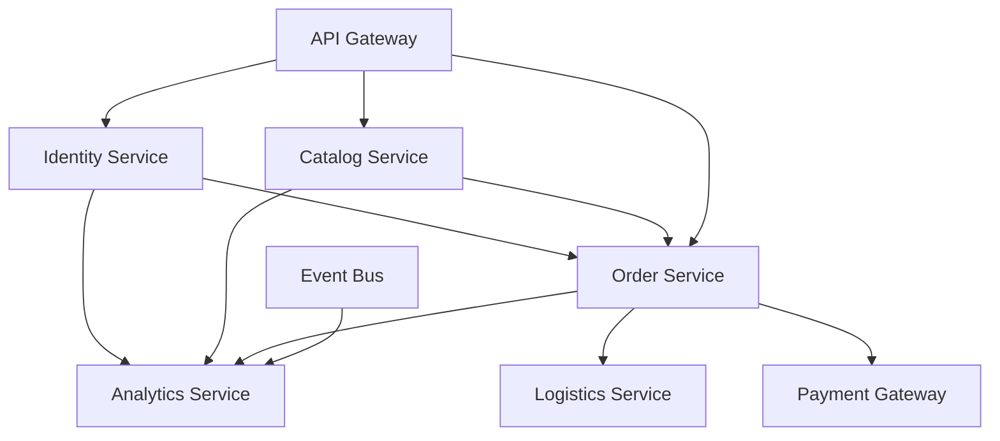

# Core Domain Glossary

> **Core Memory**: Domain definitions, entity ownership, and business terminology standards

คำอธิบายโดเมนหลักและขอบเขตการเป็นเจ้าของข้อมูลในสถาปัตยกรรม Tanqory

## Table of Contents
- [Core Domains](#core-domains)
- [Entity Definitions](#entity-definitions)
- [Domain Relationships](#domain-relationships)
- [Event Patterns](#event-patterns)
- [API Patterns](#api-patterns)
- [Security & Tokens](#security--tokens)
- [Data Ownership](#data-ownership)
- [Cross-cutting Concerns](#cross-cutting-concerns)

## Core Domains

| Domain | Entities / Concepts | Definition & Boundary | Ownership |
|-------|--------------------|-----------------------|----------|
| **Catalog** | product, variant, stock, media | จัดการข้อมูลสินค้า, ตัวเลือก (variant), คงคลัง และไฟล์สื่อ | Catalog Service |
| **Order** | cart, payment, shipment | การสั่งซื้อ ตั้งแต่ตะกร้า การชำระเงิน การจัดส่ง/คืนสินค้า | Order Service |
| **Reporting** | analytics, dashboard, event-driven materialized views | เก็บ event จากทุก service เพื่อสร้างรายงานและ dashboard แบบเรียลไทม์ | Analytics Service |
| **User/Org** | account, roles, tenant | จัดการบัญชีผู้ใช้, สิทธิ์, การเช่าใช้หลายองค์กร (multi-tenant) | Identity Service |
| **Event Bus** | Redis Streams, Kafka | backbone สื่อสารระหว่าง microservices ทั้งหมด | Platform Infrastructure |
| **Central App** | web, mobile, desktop | frontend ทุกแพลตฟอร์ม เรียก API ผ่าน Gateway เท่านั้น | Frontend Platform |

---

## Entity Definitions

### Catalog Domain
- **Product**: หน่วยสินค้าหลัก (เช่น iPhone 15) มี base information
- **Variant**: ตัวเลือกของสินค้า (เช่น สี, ขนาด, capacity) แต่ละ variant มี SKU เฉพาะ
- **Stock**: จำนวนคงเหลือของแต่ละ variant ณ เวลาหนึ่ง
- **Media**: รูปภาพ, วิดีโอ, documents ของสินค้า เก็บใน CDN
- **Category**: หมวดหมู่สินค้าแบบ hierarchical
- **Pricing**: ราคาสินค้าและ pricing rules (discount, promotion)

### Order Domain
- **Cart**: ตะกร้าสินค้าชั่วคราว (session-based) ยังไม่ยืนยัน
- **Order**: คำสั่งซื้อที่ยืนยันแล้ว มี order number และ status
- **OrderItem**: รายการสินค้าใน order แต่ละรายการ
- **Payment**: ข้อมูลการชำระเงิน status และ transaction reference
- **Shipment**: ข้อมูลการจัดส่ง tracking number และ delivery status
- **Return**: ข้อมูลการคืนสินค้า และเหตุผล

### Analytics Domain
- **Event**: raw events จาก microservices ทั้งหมด
- **MetricView**: materialized views สำหรับ real-time dashboard
- **Report**: scheduled reports และ business intelligence
- **UserBehavior**: การติดตาม user journey และ conversion funnel

### Identity Domain
- **User**: ข้อมูลผู้ใช้พื้นฐาน (profile, preferences)
- **Account**: บัญชีผู้ใช้ (authentication credentials)
- **Role**: สิทธิ์และหน้าที่ (admin, customer, vendor)
- **Tenant**: องค์กร/บริษัทใน multi-tenant system
- **Permission**: สิทธิ์ระดับ granular สำหรับ API access

---

## Domain Relationships



### Cross-Domain Integration Patterns

#### **1. Identity ↔ All Domains Integration**
```yaml
Integration_Pattern: "Identity as Central Authority"
Use_Cases:
  - User authentication for all service access
  - Permission validation across domains
  - Audit trail for user actions
  - Multi-tenant data isolation

Event_Flows:
  user_authentication:
    - user.login.attempted.v1 → Identity Service validates
    - user.login.succeeded.v1 → All services update user context
    - user.permission.validated.v1 → Service-specific authorization

API_Patterns:
  - GET /api/v1/identity/users/{id}/permissions → Returns cross-domain permissions
  - POST /api/v1/identity/tokens/validate → Validates tokens for any service
  - GET /api/v1/identity/users/{id}/context → Returns user context for personalization

Data_Sharing:
  shared_user_context:
    user_id: "Global identifier across all domains"
    tenant_id: "Multi-tenant isolation key"
    permissions: "Cross-domain permission matrix"
    preferences: "User preferences affecting all domains"
```

#### **2. Catalog ↔ Order Integration**
```yaml
Integration_Pattern: "Product-Order Lifecycle Management"
Use_Cases:
  - Real-time inventory checking during order placement
  - Price validation and updates
  - Product availability notifications
  - Order fulfillment coordination

Event_Flows:
  order_placement:
    - order.item.added.v1 → Catalog checks stock availability
    - catalog.stock.reserved.v1 → Order confirms reservation
    - order.payment.completed.v1 → Catalog commits stock reduction
    - catalog.stock.updated.v1 → Analytics updates inventory metrics

API_Patterns:
  - POST /api/v1/catalog/products/{id}/reserve → Reserve stock for order
  - PUT /api/v1/catalog/products/{id}/release → Release reserved stock
  - GET /api/v1/catalog/products/availability → Bulk availability check
  - POST /api/v1/orders/{id}/validate-pricing → Validate current pricing

Compensating_Actions:
  - order.cancelled.v1 → catalog.stock.released.v1
  - payment.failed.v1 → catalog.reservation.expired.v1
  - catalog.stock.unavailable.v1 → order.item.substituted.v1
```

#### **3. Analytics ↔ All Domains Integration**
```yaml
Integration_Pattern: "Event-Driven Analytics Aggregation"
Use_Cases:
  - Real-time business metrics calculation
  - Customer behavior analysis
  - Revenue and performance tracking
  - Predictive analytics and recommendations

Event_Flows:
  comprehensive_analytics:
    - catalog.product.viewed.v1 → Analytics tracks product interest
    - order.completed.v1 → Analytics calculates revenue metrics
    - user.preferences.updated.v1 → Analytics updates personalization
    - catalog.price.changed.v1 → Analytics tracks pricing trends

Data_Aggregation_Patterns:
  customer_360_view:
    identity_data: "User profile and preferences"
    catalog_interactions: "Product views, searches, favorites"
    order_history: "Purchase patterns and behavior"
    analytics_insights: "Recommendations and predictions"

Real_Time_Materialized_Views:
  - customer_lifetime_value → Identity + Order data
  - product_performance_metrics → Catalog + Order + Analytics
  - inventory_turnover_analysis → Catalog + Order data
  - user_engagement_scores → All domain interactions
```

#### **4. Payment ↔ Order Integration**
```yaml
Integration_Pattern: "Financial Transaction Coordination"
Use_Cases:
  - Secure payment processing
  - Financial reconciliation
  - Fraud detection and prevention
  - Refund and chargeback management

Event_Flows:
  payment_lifecycle:
    - order.payment.initiated.v1 → Payment gateway processes
    - payment.authorization.received.v1 → Order validates amount
    - payment.completed.v1 → Order confirms and fulfills
    - payment.failed.v1 → Order cancels and notifies customer

Security_Integration:
  - Tokenized payment data across domains
  - PCI compliance boundary enforcement
  - Audit trail for financial operations
  - Regulatory reporting coordination
```

### Data Flow Patterns
1. **User Registration**: Identity → Event Bus → Analytics
2. **Product Browsing**: Frontend → Gateway → Catalog → Analytics (tracking)
3. **Order Placement**: Frontend → Gateway → Order → Catalog (stock check) → Payment → Event Bus
4. **Real-time Analytics**: All Services → Event Bus → Analytics → Dashboard

### Cross-Domain Data Consistency Patterns
```yaml
Consistency_Strategies:
  strong_consistency:
    - Identity authentication (immediate validation required)
    - Payment transactions (financial accuracy critical)
    - Stock reservations (inventory conflicts prevention)

  eventual_consistency:
    - Analytics aggregations (near real-time acceptable)
    - User preference propagation (slight delay acceptable)
    - Product catalog updates (gradual rollout acceptable)

  saga_patterns:
    - Order fulfillment across multiple domains
    - User account setup with initial preferences
    - Product onboarding with pricing and inventory

---

## Event Patterns

### Naming Convention
- **Pattern**: `{domain}.{entity}.{action}.{version}`
- **Examples**:
  - `catalog.product.created.v1`
  - `order.payment.completed.v1`
  - `identity.user.registered.v1`

### Event Categories

#### Catalog Events
- `catalog.product.created`, `catalog.product.updated`, `catalog.product.deleted`
- `catalog.stock.updated`, `catalog.stock.depleted`
- `catalog.price.changed`, `catalog.variant.added`

#### Order Events
- `order.cart.item_added`, `order.cart.item_removed`, `order.cart.abandoned`
- `order.created`, `order.confirmed`, `order.cancelled`
- `order.payment.initiated`, `order.payment.completed`, `order.payment.failed`
- `order.shipment.created`, `order.shipment.shipped`, `order.shipment.delivered`

#### Identity Events
- `identity.user.registered`, `identity.user.updated`, `identity.user.deleted`
- `identity.login.success`, `identity.login.failed`
- `identity.role.assigned`, `identity.permission.granted`

### Event Schema Example
```json
{
  "eventId": "uuid",
  "eventType": "order.payment.completed.v1",
  "timestamp": "2025-09-16T10:30:00Z",
  "source": "order-service",
  "correlationId": "request-trace-id",
  "data": {
    "orderId": "ord_123",
    "paymentId": "pay_456",
    "amount": 1500.00,
    "currency": "THB"
  }
}
```

---

## API Patterns

### URL Conventions
- **RESTful Pattern**: `/{version}/{domain}/{entity}/{id}`
- **Examples**:
  - `GET /v1/catalog/products/{productId}`
  - `POST /v1/order/carts/{cartId}/items`
  - `GET /v1/identity/users/{userId}/roles`

### Standard Headers
- `Authorization: Bearer {jwt_token}`
- `X-Correlation-ID: {trace_id}`
- `X-Idempotency-Key: {unique_key}` (for write operations)
- `Accept: application/json`
- `Content-Type: application/json`

### Response Patterns
```json
{
  "data": {},
  "meta": {
    "timestamp": "2025-09-16T10:30:00Z",
    "correlationId": "trace-123"
  },
  "pagination": {
    "page": 1,
    "limit": 20,
    "total": 150
  }
}
```

---

## Security & Tokens

- **Token**: ค่าการตรวจสอบสิทธิ์ เช่น OAuth2 access token
- **JWT Claims**: `sub` (user id), `exp` (หมดอายุ), `scope` (สิทธิ์)
- **Scopes**: เช่น `catalog.read`, `order.write`, `analytics.view` ใช้กำหนดขอบเขตการเข้าถึง API

## Data Ownership

- **Catalog Service**: ข้อมูลสินค้าและสื่อทั้งหมด
- **Order Service**: ข้อมูลตะกร้า การชำระเงิน การจัดส่ง
- **Analytics Service**: materialized views และ event store (raw events ยังเป็นของ service ต้นทาง)
- **Identity Service**: ข้อมูลผู้ใช้ roles และ tenant
- **Platform Infrastructure**: Event Bus และ config stream
- **Frontend Platform**: ไม่มีข้อมูลถาวร เก็บเฉพาะ state ชั่วคราว

---

## Cross-cutting Concerns

### Audit & Logging
- **Audit Domain**: ข้อมูล audit trails ทุก write operations
- **Owner**: Platform Infrastructure
- **Retention**: 1 ปี ตาม compliance requirements

### Notifications
- **Email/SMS**: notification service แยกต่างหาก
- **Owner**: Platform Infrastructure
- **Triggered by**: events จาก order, identity services

### File Management
- **Media Storage**: CDN สำหรับ product images/videos
- **Document Storage**: secure storage สำหรับ invoices, contracts
- **Owner**: Platform Infrastructure
- **Access**: ผ่าน signed URLs เท่านั้น

### Configuration
- **Feature Flags**: runtime configuration และ A/B testing
- **Environment Config**: database connections, API keys
- **Owner**: Platform Infrastructure
- **Distribution**: config stream ใน Event Bus

---

## Business Rules & Constraints

### Stock Management
- **Real-time Updates**: stock level ต้องอัปเดตแบบเรียลไทม์
- **Negative Stock**: ไม่อนุญาตให้ stock เป็นลบ
- **Reservation**: จอง stock เมื่อเพิ่มใน cart (time-limited)

### Order Processing
- **Cart Expiry**: cart หมดอายุ 24 ชั่วโมง
- **Payment Timeout**: payment process timeout 15 นาที
- **Cancellation**: ยกเลิก order ได้ก่อน shipment เท่านั้น

### Multi-tenancy
- **Data Isolation**: ข้อมูลแต่ละ tenant แยกสมบูรณ์
- **Resource Limits**: กำหนด quota per tenant
- **Billing**: track usage per tenant สำหรับ billing

---

## Version Compatibility

### API Versioning
- **Current**: v1 สำหรับ production APIs ทั้งหมด
- **Backward Compatibility**: รองรับ API เวอร์ชันเก่า 12 เดือน
- **Deprecation**: แจ้งล่วงหน้า 6 เดือนก่อน EOL

### Event Schema Evolution
- **Schema Registry**: centralized schema management
- **Backward Compatibility**: event schema ต้อง backward compatible
- **Version Strategy**: semantic versioning สำหรับ breaking changes

---

## Related Documents
- [Core Business Policies](01_core_policies.md) - Company-wide development principles
- [Core API Standards](03_core_api_standards.md) - RESTful API standards และ OpenAPI specs
- [Core Security](04_core_security.md) - รายละเอียด security implementation
- [Core Coding Standards](05_core_coding_standards.md) - Code style และ best practices

---

*เอกสารนี้เป็น single source of truth สำหรับ domain knowledge และ business rules ของ Tanqory*

**Last Updated**: September 16, 2025
**Version**: 1.0.0