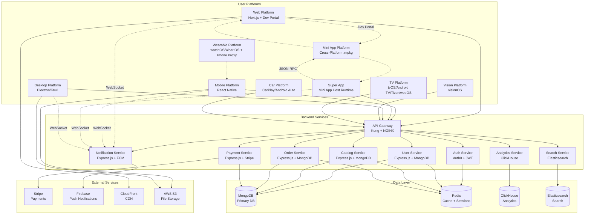

# Tanqory Platform Integration Matrix & Cross-Platform Architecture

> **Integration Memory**: Comprehensive mapping of cross-platform relationships, data flow, and integration patterns for unified billion-dollar scale operations

> **Technology Versions**: For specific version requirements, see [`memory/core/00_official_technology_versions.md`](00_official_technology_versions.md)

## Executive Summary

This document defines the complete integration architecture between Tanqory's 8 target platforms, including shared libraries, data synchronization patterns, communication protocols, and unified user experience strategies.

**Business Context**: Tanqory (TANQ PTE. LTD.) is a Singapore-based SaaS E-commerce Platform + AI Agents Marketplace positioned as a Shopify competitor with key advantages: no transaction fees, free themes, free app store access, and integrated AI marketplace.

## 🎯 **Platform Integration Overview**

### **Enhanced Cross-Platform Architecture Diagram**


## 🔗 **Shared Library Ecosystem**

### **Core Shared Libraries**
```typescript
// @tanqory/core - Core utilities and types
export interface TanqorySharedLibraries {
  // API Communication
  '@tanqory/api-client': {
    purpose: 'Unified HTTP client with platform-specific optimizations';
    platforms: ['web', 'mobile', 'desktop', 'vision', 'tv', 'watch', 'car'];
    features: [
      'Automatic retry and circuit breaker',
      'Request/response transformation',
      'Platform-specific headers and auth',
      'Offline queue and sync',
      'Error handling and reporting'
    ];
    size: '25KB gzipped';
    performance: '<5ms overhead per request';
  };

  // Authentication & Authorization
  '@tanqory/auth-sdk': {
    purpose: 'Cross-platform authentication and session management';
    platforms: ['web', 'mobile', 'desktop', 'vision', 'tv', 'watch', 'car'];
    features: [
      'OAuth 2.1 and JWT handling',
      'Biometric authentication integration',
      'Session persistence and refresh',
      'Role-based access control',
      'Multi-factor authentication'
    ];
    size: '18KB gzipped';
    security: 'SOC 2 Type II compliant';
  };

  // UI Components & Design System
  '@tanqory/ui-components': {
    purpose: 'Platform-adaptive UI components with unified design system';
    platforms: ['web', 'mobile', 'desktop'];
    features: [
      'Responsive design tokens',
      'Platform-specific adaptations',
      'Accessibility compliance (WCAG 2.1 AA)',
      'Theme and localization support',
      'Animation and interaction patterns'
    ];
    size: '45KB gzipped (web), 35KB (mobile)';
    performance: 'Zero runtime CSS-in-JS for web';
  };

  // State Management
  '@tanqory/unified-state': {
    purpose: 'Cross-platform state synchronization and management';
    platforms: ['web', 'mobile', 'desktop'];
    features: [
      'Real-time state synchronization',
      'Offline-first architecture',
      'Conflict resolution algorithms',
      'Platform-specific persistence',
      'Developer tools and debugging'
    ];
    size: '22KB gzipped';
    performance: 'Sub-millisecond state updates';
  };

  // Analytics & Tracking
  '@tanqory/analytics': {
    purpose: 'Unified analytics and user behavior tracking';
    platforms: ['web', 'mobile', 'desktop', 'vision', 'tv', 'watch', 'car'];
    features: [
      'Event tracking and user journeys',
      'Performance monitoring',
      'A/B testing and feature flags',
      'Privacy-compliant data collection',
      'Real-time dashboard updates'
    ];
    size: '12KB gzipped';
    privacy: 'GDPR and CCPA compliant';
  };

  // Crypto & Security
  '@tanqory/crypto-utils': {
    purpose: 'Cryptographic utilities and security functions';
    platforms: ['web', 'mobile', 'desktop', 'vision', 'tv', 'watch', 'car'];
    features: [
      'End-to-end encryption',
      'Secure key management',
      'Data integrity validation',
      'Platform-specific secure storage',
      'Compliance with security standards'
    ];
    size: '15KB gzipped';
    security: 'FIPS 140-2 Level 2 validated';
  };

  // Platform Utilities
  '@tanqory/platform-utils': {
    purpose: 'Platform detection, capabilities, and adaptation utilities';
    platforms: ['web', 'mobile', 'desktop', 'vision', 'tv', 'watch', 'car'];
    features: [
      'Platform and device detection',
      'Capability detection and polyfills',
      'Environment configuration',
      'Cross-platform storage abstraction',
      'Network and connectivity utilities'
    ];
    size: '8KB gzipped';
    performance: 'Zero runtime overhead for detection';
  };
}
```

### **Platform-Specific Integrations**
```typescript
// Platform-specific integration patterns
export interface PlatformIntegrations {
  // Web Platform Integrations
  web: {
    shared_libraries: [
      '@tanqory/api-client',
      '@tanqory/auth-sdk',
      '@tanqory/ui-components',
      '@tanqory/unified-state',
      '@tanqory/analytics',
      '@tanqory/crypto-utils',
      '@tanqory/platform-utils'
    ];
    unique_features: [
      'Service Worker for offline functionality',
      'Web Push notifications',
      'Progressive Web App capabilities',
      'SEO optimization and meta tags',
      'Web Share API integration',
      'Payment Request API support'
    ];
    data_sync: 'Real-time via WebSocket + Server-Sent Events';
    storage: 'IndexedDB + localStorage + sessionStorage';
    performance: 'Core Web Vitals optimization';
  };

  // Mobile Platform Integrations
  mobile: {
    shared_libraries: [
      '@tanqory/api-client',
      '@tanqory/auth-sdk',
      '@tanqory/ui-components',
      '@tanqory/unified-state',
      '@tanqory/analytics',
      '@tanqory/crypto-utils',
      '@tanqory/platform-utils'
    ];
    unique_features: [
      'Push notifications via FCM/APNs',
      'Biometric authentication',
      'Camera and QR code scanning',
      'Location services and geofencing',
      'Background app refresh',
      'Deep linking and universal links',
      'In-app purchase integration'
    ];
    data_sync: 'Background sync + real-time WebSocket';
    storage: 'AsyncStorage + SQLite + Keychain/Keystore';
    performance: 'New Architecture optimization';
  };

  // Desktop Platform Integrations
  desktop: {
    shared_libraries: [
      '@tanqory/api-client',
      '@tanqory/auth-sdk',
      '@tanqory/ui-components',
      '@tanqory/unified-state',
      '@tanqory/analytics',
      '@tanqory/crypto-utils',
      '@tanqory/platform-utils'
    ];
    unique_features: [
      'Framework choice: Electron vs Tauri',
      'Native system notifications',
      'System tray and menu bar integration',
      'File system access and operations',
      'Auto-updater with delta updates',
      'Native window management',
      'System theme detection',
      'Keyboard shortcuts and accessibility',
      'Turborepo monorepo integration'
    ];
    data_sync: 'Real-time via WebSocket + local SQLite';
    storage: 'Electron Store/Tauri + SQLite + OS keychain';
    performance: 'Process isolation and security (Electron) / WebView efficiency (Tauri)';
  };

  // Mini App Platform Integration
  miniapp: {
    shared_libraries: [
      '@tanqory/miniapp-sdk',
      '@tanqory/cross-platform-renderer',
      '@tanqory/permission-manager'
    ];
    unique_features: [
      'Manifest-first architecture',
      '.mpkg package format',
      'Cross-platform IR generation',
      'Phased rollout system (5% → 25% → 100%)',
      'Digital signature verification',
      'Permission-based sandbox execution',
      'Multi-platform renderers (React DOM, RN, SwiftUI, Compose)'
    ];
    data_sync: 'Host-dependent (Super App/Web runtime)';
    storage: 'Host-managed with permission restrictions';
    performance: 'Optimized for <2s load time, <64MB memory';
  };

  // Super App Integration
  superapp: {
    shared_libraries: [
      '@tanqory/api-client',
      '@tanqory/auth-sdk',
      '@tanqory/unified-state',
      '@tanqory/analytics',
      '@tanqory/miniapp-runtime'
    ];
    unique_features: [
      'Mini App host runtime environment',
      'JSON-RPC bridge system',
      'Sandbox execution environment',
      'Permission management system',
      'Phased Mini App rollout',
      'Kill-switch capabilities',
      'Performance monitoring for Mini Apps',
      'OTA Mini App updates'
    ];
    data_sync: 'Real-time WebSocket + Mini App state sync';
    storage: 'AsyncStorage + SQLite + Mini App isolation';
    performance: 'Optimized for Mini App hosting <256MB total';
  };

  // Vision Platform Integrations
  vision: {
    shared_libraries: [
      '@tanqory/api-client',
      '@tanqory/auth-sdk',
      '@tanqory/analytics',
      '@tanqory/crypto-utils',
      '@tanqory/platform-utils'
    ];
    unique_features: [
      'Spatial computing and 3D interactions',
      'Hand tracking and gesture recognition',
      'Eye tracking for navigation',
      '3D product visualization',
      'Immersive shopping experiences',
      'Mixed reality overlays',
      'Spatial audio integration'
    ];
    data_sync: 'CloudKit + custom API integration';
    storage: 'CloudKit + Core Data + UserDefaults';
    performance: 'Optimized for spatial computing';
  };

  // TV Platform Integrations
  tv: {
    shared_libraries: [
      '@tanqory/api-client',
      '@tanqory/auth-sdk',
      '@tanqory/analytics',
      '@tanqory/crypto-utils',
      '@tanqory/platform-utils'
    ];
    unique_features: [
      'Multi-platform support (tvOS, Android TV, Tizen, webOS)',
      'Remote control navigation with focus management',
      '4K and HDR content support',
      'Voice control integration',
      '10-foot lean-back user interface',
      'Mobile checkout handoff via QR codes',
      'Screen mirroring from mobile',
      'Multi-user profiles',
      'Parental controls'
    ];
    data_sync: 'Periodic sync + on-demand loading';
    storage: 'Platform-specific local storage';
    performance: '10-foot UI optimization + <5s load time';
  };

  // Wearable Platform Integrations
  wearable: {
    shared_libraries: [
      '@tanqory/api-client',
      '@tanqory/auth-sdk',
      '@tanqory/analytics',
      '@tanqory/crypto-utils',
      '@tanqory/platform-utils'
    ];
    unique_features: [
      'Phone proxy networking architecture',
      'Complication widgets',
      'Health and fitness integration',
      'Always-on display optimization',
      'Rich haptic feedback patterns',
      'Voice control via Siri/Google Assistant',
      'Quick actions and shortcuts',
      '"Confirm on Watch → Pay on Phone" flow',
      'Battery optimization <5% drain/hour'
    ];
    data_sync: 'Phone companion app + cloud sync via proxy';
    storage: 'Minimal local storage + phone delegation';
    performance: 'Ultra-low power optimization + <500ms response';
  };

  // Car Platform Integrations
  car: {
    shared_libraries: [
      '@tanqory/api-client',
      '@tanqory/auth-sdk',
      '@tanqory/analytics',
      '@tanqory/crypto-utils',
      '@tanqory/platform-utils'
    ];
    unique_features: [
      'Voice-first interface design',
      'CarPlay and Android Auto integration',
      'Location and navigation integration',
      'Hands-free operation',
      'Safety compliance (NHTSA guidelines)',
      'Integration with car systems',
      'Emergency and roadside assistance'
    ];
    data_sync: 'Phone-based sync + cached data';
    storage: 'Minimal storage + phone delegation';
    performance: 'Safety-optimized interface';
  };
}
```

## 📊 **Data Flow and Synchronization**

### **Unified Data Architecture**
```yaml
Data Synchronization Strategy:
  real_time_sync:
    technology: "WebSocket connections + Server-Sent Events"
    use_cases:
      - Cart updates across devices
      - Order status changes
      - Inventory updates
      - Real-time notifications
      - Live chat and support
    latency: "<100ms globally"
    reliability: "99.9% message delivery"

  offline_first_sync:
    technology: "Background sync + conflict resolution"
    use_cases:
      - User preferences and settings
      - Draft orders and wishlists
      - Analytics events and tracking
      - Content caching and preloading
    strategy: "Last-write-wins with timestamp comparison"
    conflict_resolution: "User-choice dialog for critical conflicts"

  batch_sync:
    technology: "Scheduled sync + delta updates"
    use_cases:
      - Product catalog updates
      - User profile synchronization
      - Analytics data aggregation
      - Content delivery and caching
    frequency: "Every 15 minutes for non-critical data"
    optimization: "Delta sync reduces bandwidth by 90%"

Cross-Platform Data Consistency:
  user_state:
    authentication: "JWT tokens synced across all platforms"
    preferences: "Real-time sync via WebSocket"
    shopping_cart: "Immediate sync with optimistic updates"
    order_history: "Eventual consistency with background sync"

  application_state:
    theme_settings: "Synced via user preferences"
    language_locale: "Immediate sync across platforms"
    notification_settings: "Platform-specific with fallbacks"
    feature_flags: "Real-time distribution via WebSocket"

  business_data:
    product_catalog: "Eventually consistent with cache invalidation"
    inventory_levels: "Real-time updates for active sessions"
    pricing_promotions: "Immediate sync to prevent discrepancies"
    order_processing: "Strong consistency with distributed transactions"
```

### **API Gateway Integration Pattern**
```typescript
// Unified API gateway configuration
export interface TanqoryAPIGateway {
  // Request routing and load balancing
  routing: {
    web_platform: {
      endpoints: '/api/v1/web/*';
      rate_limit: '1000 requests/minute/user';
      caching: 'Aggressive caching with CDN';
      optimization: 'Response compression and minification';
    };

    mobile_platform: {
      endpoints: '/api/v1/mobile/*';
      rate_limit: '500 requests/minute/user';
      caching: 'Smart caching with offline support';
      optimization: 'Data compression and payload optimization';
    };

    desktop_platform: {
      endpoints: '/api/v1/desktop/*';
      rate_limit: '750 requests/minute/user';
      caching: 'Local caching with real-time updates';
      optimization: 'Bulk operations and batch requests';
    };

    specialized_platforms: {
      endpoints: '/api/v1/{platform}/*';
      rate_limit: '200 requests/minute/user';
      caching: 'Platform-optimized caching strategies';
      optimization: 'Minimal payload with essential data only';
    };
  };

  // Authentication and authorization
  security: {
    jwt_validation: 'Centralized JWT validation with Redis cache';
    rate_limiting: 'Distributed rate limiting with Redis';
    cors_policy: 'Platform-specific CORS configurations';
    api_versioning: 'URL-based versioning with backward compatibility';
  };

  // Monitoring and observability
  observability: {
    request_tracing: 'Distributed tracing with Jaeger';
    metrics_collection: 'Prometheus metrics with custom labels';
    error_reporting: 'Centralized error reporting via Sentry';
    performance_monitoring: 'Real-time performance metrics';
  };

  // Platform-specific adaptations
  adaptations: {
    request_transformation: 'Platform-specific request/response transformation';
    error_handling: 'Platform-appropriate error formats';
    data_compression: 'Adaptive compression based on platform capabilities';
    regional_routing: 'Geographic request routing for compliance';
  };
}
```

## 🔐 **Cross-Platform Security Architecture**

### **Unified Security Framework**
```yaml
Authentication Flow:
  initial_login:
    web: "OAuth 2.1 flow with PKCE + JWT tokens"
    mobile: "OAuth 2.1 with biometric confirmation"
    desktop: "OAuth 2.1 with system keychain integration"
    specialized: "Simplified OAuth flow with device registration"

  token_management:
    access_token: "15-minute expiry with automatic refresh"
    refresh_token: "30-day expiry with rotation"
    storage: "Platform-specific secure storage (Keychain, Credential Manager)"
    synchronization: "Secure token sharing via encrypted channels"

  session_handling:
    web: "HTTPOnly cookies + JWT in memory"
    mobile: "Secure storage in iOS Keychain / Android Keystore"
    desktop: "Encrypted storage in OS credential manager"
    cross_platform: "Session state synchronized via secure WebSocket"

Authorization Patterns:
  role_based_access:
    roles: ["admin", "user", "moderator", "support", "analyst"]
    permissions: "Fine-grained permissions per platform capability"
    inheritance: "Role inheritance with platform-specific overrides"
    caching: "Permission cache with 5-minute TTL"

  resource_access:
    api_authorization: "JWT claims-based authorization"
    data_access: "Row-level security in database layer"
    file_access: "Signed URLs with time-based expiration"
    feature_flags: "User-level feature access control"

Security Compliance:
  data_protection:
    encryption_at_rest: "AES-256 encryption for all stored data"
    encryption_in_transit: "TLS 1.3 for all communications"
    key_management: "AWS KMS for encryption key management"
    pii_handling: "GDPR and CCPA compliant data processing"

  platform_security:
    web_security: "CSP headers, XSS protection, CSRF tokens"
    mobile_security: "Certificate pinning, root detection, tamper detection"
    desktop_security: "Code signing, sandboxing, auto-update verification"
    api_security: "Rate limiting, DDoS protection, WAF integration"
```

### **Privacy and Compliance Integration**
```typescript
// Cross-platform privacy compliance
export interface TanqoryPrivacyCompliance {
  // GDPR Compliance
  gdpr: {
    consent_management: {
      web: 'Cookie consent banner with granular controls';
      mobile: 'Native consent dialogs with system integration';
      desktop: 'OS-native privacy dialogs';
      data_collection: 'Explicit consent for all non-essential data';
    };

    data_portability: {
      export_format: 'JSON and CSV export capabilities';
      export_scope: 'All user data across all platforms';
      delivery_method: 'Secure download links with expiration';
      processing_time: 'Within 30 days as required by GDPR';
    };

    right_to_deletion: {
      deletion_scope: 'Complete user data removal across all systems';
      retention_policy: 'Legal and business requirement exceptions';
      confirmation: 'Multi-step verification process';
      completion_timeline: 'Within 30 days with confirmation';
    };
  };

  // CCPA Compliance
  ccpa: {
    do_not_sell: 'Global privacy control integration';
    data_categories: 'Clear categorization of collected data';
    third_party_sharing: 'Explicit disclosure of data sharing';
    opt_out_mechanisms: 'Easy opt-out across all platforms';
  };

  // Platform-specific privacy features
  platform_privacy: {
    ios: 'App Tracking Transparency compliance';
    android: 'Privacy-focused permissions and data access';
    web: 'Privacy-focused analytics and tracking';
    desktop: 'System privacy integration and controls';
  };
}
```

## 🚀 **Performance Optimization Matrix**

### **Cross-Platform Performance Strategy**
```yaml
Performance Optimization Patterns:

Web Platform:
  core_web_vitals:
    largest_contentful_paint: "<2.5s (Target: <1.8s)"
    first_input_delay: "<100ms (Target: <75ms)"
    cumulative_layout_shift: "<0.1 (Target: <0.05)"

  optimization_techniques:
    - Next.js Server Components for reduced bundle size
    - Automatic image optimization with WebP/AVIF
    - Aggressive caching with service workers
    - Code splitting and lazy loading
    - CDN deployment for global performance

Mobile Platform:
  app_performance:
    startup_time: "<2s cold start (Target: <1.5s)"
    frame_rate: "60fps consistent (Target: 99%+ time)"
    memory_usage: "<150MB average (Target: <120MB)"
    battery_efficiency: "Optimized background processing"

  optimization_techniques:
    - React Native New Architecture (Fabric + TurboModules)
    - Hermes JavaScript engine for Android
    - Image caching and lazy loading
    - Background task optimization
    - Network request deduplication

Desktop Platform:
  desktop_performance:
    startup_time: "<3s (Target: <2s)"
    memory_usage: "<200MB idle (Target: <150MB)"
    cpu_usage: "<5% idle (Target: <3%)"
    disk_usage: "<100MB (Target: <75MB)"

  optimization_techniques:
    - Process isolation for security and performance
    - Native module optimization
    - Incremental updates with delta patching
    - Resource bundling and compression
    - Background process optimization

Specialized Platforms:
  vision_platform:
    - 3D rendering optimization for spatial computing
    - Hand tracking performance optimization
    - Memory management for immersive experiences
    - Spatial audio processing efficiency

  tv_platform:
    - 4K video streaming optimization
    - Remote control response time <200ms
    - Memory management for lean-back experience
    - Background processing minimization

  watch_platform:
    - Ultra-low power consumption
    - Minimal network usage
    - Instant complication updates
    - Background refresh optimization

  car_platform:
    - Voice recognition optimization
    - Minimal visual distraction
    - Quick response for safety-critical features
    - Integration with car system performance
```

### **Global Performance Monitoring**
```typescript
// Unified performance monitoring across platforms
export interface TanqoryPerformanceMonitoring {
  // Real-time performance metrics
  metrics: {
    web_vitals: {
      core_web_vitals: 'Lighthouse CI + RUM data collection';
      custom_metrics: 'Time to first paint, Time to interactive';
      user_experience: 'Real user monitoring across global regions';
      performance_budgets: 'Automated alerts for threshold breaches';
    };

    mobile_performance: {
      app_metrics: 'Startup time, frame rate, memory usage';
      crash_reporting: 'Real-time crash detection and reporting';
      network_performance: 'API response times and failure rates';
      battery_usage: 'Background and foreground power consumption';
    };

    backend_performance: {
      api_response_times: '95th percentile tracking across endpoints';
      database_performance: 'Query optimization and slow query detection';
      cache_hit_ratios: 'Redis and CDN cache effectiveness';
      error_rates: 'Service-level error tracking and alerting';
    };
  };

  // Performance optimization automation
  optimization: {
    auto_scaling: 'Kubernetes HPA based on performance metrics';
    cache_warming: 'Predictive cache warming based on usage patterns';
    image_optimization: 'Automatic format conversion and compression';
    code_splitting: 'Automated bundle analysis and optimization';
  };

  // Cross-platform performance correlation
  correlation: {
    user_journey: 'Performance impact across platform transitions';
    feature_performance: 'Feature-specific performance across platforms';
    regional_performance: 'Geographic performance variations';
    device_performance: 'Device-specific optimization opportunities';
  };
}
```

## 📱 **Platform-Specific Integration Details**

### **Web ↔ Mobile Integration**
```yaml
Data Synchronization:
  shared_state:
    shopping_cart: "Real-time sync with optimistic updates"
    user_preferences: "Immediate sync via WebSocket"
    browsing_history: "Background sync with privacy controls"
    saved_items: "Cross-platform wishlist synchronization"

  platform_handoff:
    web_to_mobile: "QR code scanning for instant session transfer"
    mobile_to_web: "Universal links with session continuation"
    shared_sessions: "Authenticated session sharing via secure tokens"

  unique_capabilities:
    web_exclusive: "Advanced search and filtering, detailed product views"
    mobile_exclusive: "Camera scanning, location services, push notifications"
    complementary_features: "Mobile scan → Web detailed view → Mobile purchase"

Feature Parity Matrix:
  core_features: "100% feature parity for essential e-commerce functions"
  enhanced_features: "Platform-optimized enhancements (mobile camera, web analytics)"
  progressive_enhancement: "Features gracefully degrade across platforms"
```

### **Desktop ↔ Platform Ecosystem Integration**
```yaml
Desktop as Hub:
  productivity_features:
    bulk_operations: "Batch order management and inventory updates"
    advanced_analytics: "Detailed reporting and business intelligence"
    file_management: "Document upload, export, and organization"
    multi_window: "Side-by-side comparison and workflow optimization"

  synchronization_hub:
    cross_platform_sync: "Desktop as synchronization coordinator"
    backup_and_restore: "Complete platform state backup and recovery"
    data_export: "Advanced export capabilities for business users"
    integration_tools: "Third-party service integration and automation"

Enterprise Integration:
  business_tools: "Integration with existing enterprise systems"
  admin_functions: "Advanced administration and user management"
  reporting_suite: "Comprehensive business reporting and analytics"
  workflow_automation: "Custom business process automation"
```

### **Specialized Platform Integration**
```yaml
Vision Platform Integration:
  immersive_commerce:
    3d_product_views: "Spatial product visualization and interaction"
    virtual_showroom: "Immersive shopping environment"
    ar_try_on: "Augmented reality product try-on experiences"
    spatial_ui: "3D user interface optimized for hand/eye tracking"

  cross_platform_continuity:
    session_handoff: "Seamless transition from 2D to 3D shopping"
    shared_cart: "Shopping cart synchronized across all platforms"
    preference_sync: "Spatial preferences and settings synchronization"

TV Platform Integration:
  living_room_commerce:
    lean_back_browsing: "Optimized for 10-foot viewing distance"
    voice_commerce: "Voice-activated shopping and navigation"
    family_features: "Multi-user profiles and parental controls"
    screen_casting: "Mobile to TV content casting and control"

Watch Platform Integration:
  micro_interactions:
    quick_actions: "One-tap ordering and status checking"
    notifications: "Order updates and promotional alerts"
    complications: "Widget-based information display"
    health_integration: "Health and fitness product recommendations"

Car Platform Integration:
  mobility_commerce:
    voice_first: "Hands-free shopping via voice commands"
    location_aware: "Location-based store finder and services"
    safety_optimized: "Minimal visual distraction interface"
    journey_integration: "Commerce integrated with travel and navigation"
```

## 🔄 **Real-Time Communication Architecture**

### **WebSocket and Real-Time Messaging**
```typescript
// Real-time communication infrastructure
export interface TanqoryRealTimeArchitecture {
  // WebSocket connection management
  connection_management: {
    web_platform: {
      technology: 'Native WebSocket with Socket.io fallback';
      connection_pooling: 'Multiple connections for different data types';
      reconnection: 'Exponential backoff with jitter';
      heartbeat: '30-second ping/pong for connection health';
    };

    mobile_platform: {
      technology: 'WebSocket with background task support';
      connection_persistence: 'Maintain connection during app backgrounding';
      cellular_optimization: 'Adaptive quality based on network conditions';
      battery_optimization: 'Smart connection management for power efficiency';
    };

    desktop_platform: {
      technology: 'Persistent WebSocket with native event integration';
      system_integration: 'Native notifications and system tray updates';
      multi_window: 'Shared connection across multiple application windows';
      offline_queue: 'Message queuing for offline scenarios';
    };
  };

  // Message types and routing
  message_routing: {
    user_specific: {
      cart_updates: 'Real-time shopping cart synchronization';
      order_status: 'Order processing and delivery status updates';
      notifications: 'Personalized alerts and promotional messages';
      session_events: 'Cross-platform session management events';
    };

    broadcast: {
      inventory_updates: 'Product availability and pricing changes';
      system_announcements: 'Platform-wide announcements and maintenance';
      promotional_events: 'Time-sensitive promotions and flash sales';
      feature_flags: 'Real-time feature flag updates';
    };

    platform_specific: {
      web_analytics: 'Real-time user behavior and performance metrics';
      mobile_location: 'Location-based offers and store information';
      desktop_productivity: 'Bulk operation status and completion events';
    };
  };

  // Scalability and performance
  scalability: {
    connection_limits: '10K concurrent connections per server instance';
    message_throughput: '100K messages per second sustained';
    geographic_distribution: 'WebSocket servers in each AWS region';
    load_balancing: 'Sticky sessions with graceful failover';
  };

  // Reliability and error handling
  reliability: {
    message_delivery: 'At-least-once delivery guarantee for critical messages';
    duplicate_detection: 'Message deduplication using unique identifiers';
    error_recovery: 'Automatic retry with exponential backoff';
    circuit_breaker: 'Automatic disconnection for unhealthy connections';
  };
}
```

### **Push Notification Integration**
```yaml
Cross-Platform Notification Strategy:

Web Platform:
  technology: "Web Push API with service worker"
  features:
    - Browser native notifications
    - Offline notification queuing
    - Action buttons and rich media
    - Notification center integration
  personalization: "User preference based targeting"

Mobile Platform:
  technology: "Firebase Cloud Messaging (FCM) + Apple Push Notification (APNs)"
  features:
    - Rich notifications with images and actions
    - Background notification processing
    - Badge count updates
    - Deep linking to specific app sections
  personalization: "Machine learning based targeting"

Desktop Platform:
  technology: "System native notifications"
  features:
    - Operating system notification center
    - Sound and visual customization
    - Action buttons for quick responses
    - Do not disturb integration
  personalization: "Work schedule aware delivery"

Specialized Platforms:
  watch: "Haptic feedback + brief visual notifications"
  tv: "Non-intrusive overlay notifications"
  car: "Voice-only notifications for safety"
  vision: "Spatial notification placement"

Unified Notification Management:
  delivery_optimization:
    - Cross-platform deduplication
    - Smart delivery timing based on user activity
    - Preference-based channel selection
    - A/B testing for notification effectiveness

  privacy_and_consent:
    - Granular notification preferences
    - Easy opt-out mechanisms
    - GDPR compliant consent management
    - Analytics while preserving privacy
```

## 📈 **Analytics and Business Intelligence Integration**

### **Unified Analytics Architecture**
```typescript
// Cross-platform analytics and BI integration
export interface TanqoryAnalyticsIntegration {
  // Event tracking across platforms
  event_tracking: {
    user_journey: {
      cross_platform_sessions: 'Track user journey across all platforms';
      conversion_funnels: 'Multi-platform conversion analysis';
      platform_transitions: 'Track platform switching patterns';
      session_continuity: 'Measure session handoff effectiveness';
    };

    business_metrics: {
      revenue_attribution: 'Platform-specific revenue contribution';
      customer_lifetime_value: 'Cross-platform CLV calculation';
      acquisition_costs: 'Platform-specific customer acquisition';
      retention_analysis: 'Multi-platform user retention patterns';
    };

    performance_metrics: {
      platform_performance: 'Performance metrics per platform';
      feature_usage: 'Cross-platform feature adoption rates';
      error_tracking: 'Error patterns and platform correlation';
      user_experience: 'Satisfaction metrics across platforms';
    };
  };

  // Real-time dashboard integration
  dashboard_integration: {
    business_intelligence: {
      technology: 'ClickHouse + Grafana + Custom dashboards';
      update_frequency: 'Real-time updates with 30-second refresh';
      data_visualization: 'Interactive charts and cross-platform comparisons';
      alert_system: 'Automated alerts for metric thresholds';
    };

    platform_specific_insights: {
      web_analytics: 'Core Web Vitals, SEO metrics, conversion rates';
      mobile_analytics: 'App store metrics, crash rates, user engagement';
      desktop_analytics: 'Feature usage, productivity metrics, satisfaction';
      specialized_platforms: 'Platform-specific KPIs and usage patterns';
    };
  };

  // Privacy-compliant data collection
  privacy_compliance: {
    data_collection: 'Minimal data collection with explicit consent';
    anonymization: 'Automatic PII anonymization and aggregation';
    retention_policies: 'Configurable data retention per region';
    user_controls: 'User dashboard for data visibility and control';
  };
}
```

## 🛡️ **Disaster Recovery and Business Continuity**

### **Cross-Platform Resilience Strategy**
```yaml
Disaster Recovery Architecture:

Multi-Region Failover:
  primary_regions: "us-east-1 (Primary), eu-west-1 (Secondary), ap-southeast-1 (Tertiary)"
  failover_strategy: "Automated failover with 99.99% availability target"
  data_replication: "Real-time MongoDB replica sets across regions"
  cache_synchronization: "Redis cross-region replication for session data"

  recovery_time_objectives:
    web_platform: "RTO: 5 minutes, RPO: 1 minute"
    mobile_platform: "RTO: 10 minutes, RPO: 5 minutes"
    desktop_platform: "RTO: 15 minutes, RPO: 5 minutes"
    specialized_platforms: "RTO: 30 minutes, RPO: 15 minutes"

Platform-Specific Resilience:
  web_platform:
    - CDN failover to secondary origins
    - Static site generation for critical pages
    - Service worker for offline functionality
    - Progressive web app caching strategies

  mobile_platform:
    - Offline-first architecture with local SQLite
    - Background sync when connectivity restored
    - Cached content for essential features
    - Graceful degradation for network issues

  desktop_platform:
    - Local data synchronization and backup
    - Offline mode for productivity features
    - Automatic retry mechanisms
    - Local caching of frequently accessed data

Business Continuity Planning:
  communication_strategy: "Multi-channel status communication"
  customer_support: "24/7 support with escalation procedures"
  partner_integration: "Third-party service failover plans"
  regulatory_compliance: "Incident reporting and compliance measures"
```

---

**Document Classification**: CONFIDENTIAL
**Business Impact**: CRITICAL - Billion-dollar platform integration strategy
**Review Cycle**: Monthly (due to rapid platform evolution)
**Integration Dependencies**: All platform development teams

**Last Updated**: September 16, 2025
**Version**: 1.0.0
**Next Review**: October 16, 2025