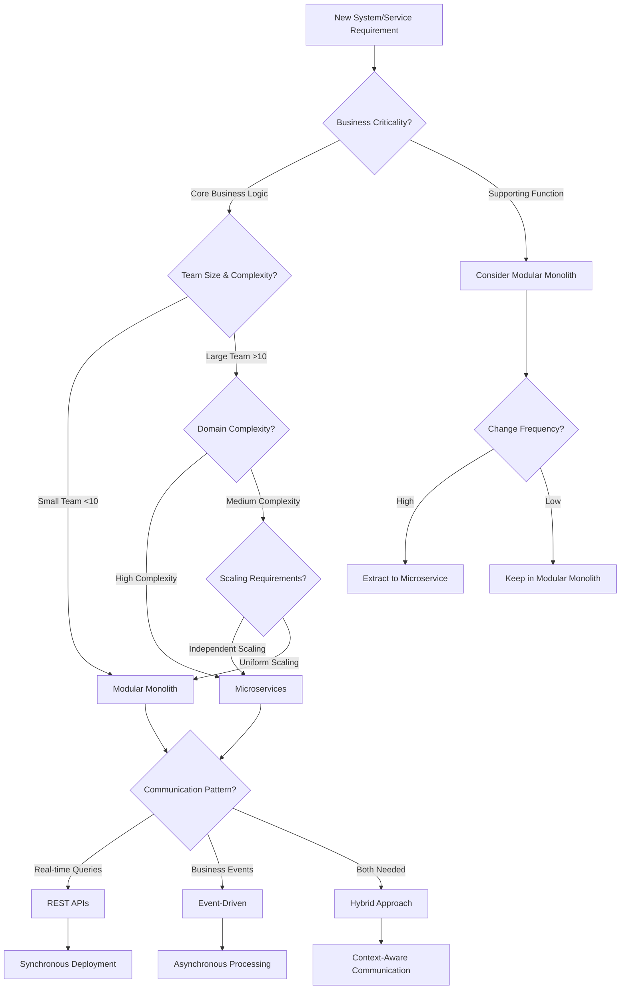

# Unified Architecture Decision Framework

> **Architecture Memory**: กำหนดกรอบการตัดสินใจด้านสถาปัตยกรรมที่เป็นมาตรฐานเดียวกันทั่วทั้งระบบ พร้อมเกณฑ์การเลือกใช้ patterns และแนวทางที่ชัดเจนสำหรับการแก้ไขความขัดแย้งระหว่างแนวทางต่างๆ

## Table of Contents
- [Decision Framework Overview](#decision-framework-overview)
- [Architecture Pattern Selection Criteria](#architecture-pattern-selection-criteria)
- [Hybrid Architecture Strategy](#hybrid-architecture-strategy)
- [Decision Trees and Guidelines](#decision-trees-and-guidelines)
- [Integration Patterns](#integration-patterns)
- [Deployment Strategy Guidelines](#deployment-strategy-guidelines)

---

## Decision Framework Overview

### **Unified Architecture Principles**
```yaml
Architecture_Decision_Principles:
  business_value_first:
    principle: "Architecture decisions must directly support business objectives"
    criteria:
      - "Time to market impact"
      - "Operational cost implications"
      - "Scalability requirements"
      - "Team productivity impact"

  risk_balanced:
    principle: "Balance innovation with proven stability"
    criteria:
      - "Technical risk assessment"
      - "Team expertise availability"
      - "Vendor/technology maturity"
      - "Recovery and rollback capability"

  evolution_ready:
    principle: "Design for change and future requirements"
    criteria:
      - "Modularity and decoupling"
      - "Migration path clarity"
      - "Backward compatibility"
      - "Technology upgrade path"

  operational_excellence:
    principle: "Optimize for production operations"
    criteria:
      - "Monitoring and observability"
      - "Deployment automation"
      - "Recovery procedures"
      - "Performance characteristics"

Decision_Authority_Matrix:
  application_level:
    authority: "Senior Developer + Tech Lead"
    scope: "Single application architecture decisions"
    examples: ["Framework selection", "Library choices", "Local patterns"]

  service_level:
    authority: "Principal Engineer + Architecture Review"
    scope: "Service boundary and integration decisions"
    examples: ["Service decomposition", "API design", "Data modeling"]

  system_level:
    authority: "Architecture Review Board"
    scope: "Cross-system and enterprise architecture decisions"
    examples: ["Technology stack", "Infrastructure patterns", "Security standards"]

  enterprise_level:
    authority: "CTO + Executive Team"
    scope: "Strategic technology and platform decisions"
    examples: ["Cloud strategy", "Technology partnerships", "Major platform changes"]
```

## Architecture Pattern Selection Criteria

### **1. Microservices vs Monolith Decision Matrix**
```yaml
Monolithic_Architecture:
  use_when:
    team_size: "< 10 developers"
    system_complexity: "Low to moderate business complexity"
    deployment_frequency: "Weekly or less frequent deployments"
    data_consistency: "Strong consistency requirements across domains"
    organizational_maturity: "Limited DevOps/automation capability"
    performance_requirements: "Low latency, high-throughput needs"

  benefits:
    - "Simplified deployment and testing"
    - "Better performance (no network calls)"
    - "Easier debugging and monitoring"
    - "Lower operational complexity"
    - "Simplified data consistency"

  constraints:
    - "Single technology stack"
    - "Shared failure modes"
    - "Scaling bottlenecks"
    - "Team coordination challenges at scale"

Microservices_Architecture:
  use_when:
    team_size: "> 10 developers (multiple teams)"
    system_complexity: "High business domain complexity"
    deployment_frequency: "Daily or multiple deployments per day"
    scaling_requirements: "Independent scaling needs per domain"
    technology_diversity: "Different technology stacks needed"
    organizational_maturity: "Strong DevOps and automation practices"

  benefits:
    - "Independent deployment and scaling"
    - "Technology diversity"
    - "Team autonomy"
    - "Failure isolation"
    - "Faster development cycles"

  constraints:
    - "Higher operational complexity"
    - "Network latency and failures"
    - "Data consistency challenges"
    - "Distributed system complexity"

Modular_Monolith:
  use_when:
    description: "Compromise solution - single deployment with modular internal structure"
    team_size: "10-20 developers"
    system_complexity: "Moderate to high complexity"
    migration_strategy: "Preparing for future microservices migration"
    operational_maturity: "Developing DevOps capabilities"

  benefits:
    - "Clear module boundaries"
    - "Simplified deployment"
    - "Migration path to microservices"
    - "Better than traditional monolith"

  implementation:
    module_structure: "Domain-driven module boundaries"
    communication: "In-process APIs with clear interfaces"
    data_access: "Module-specific data access layers"
    testing: "Module-level testing strategies"
```

### **2. Event-Driven vs REST API Decision Matrix**
```yaml
REST_API_Communication:
  use_when:
    interaction_type: "Request-response pattern needed"
    consistency_requirements: "Immediate consistency required"
    client_needs: "Synchronous client interactions"
    operation_type: "CRUD operations on resources"
    debugging_requirements: "Easy debugging and testing needed"

  patterns:
    - "Client-server interactions"
    - "Resource-based operations"
    - "Real-time queries"
    - "User-facing operations"
    - "Simple integrations"

  benefits:
    - "Simple to understand and implement"
    - "Excellent tooling and debugging"
    - "Direct request-response mapping"
    - "Standard HTTP semantics"

  limitations:
    - "Tight coupling between services"
    - "Synchronous dependency chains"
    - "Limited scalability patterns"

Event_Driven_Communication:
  use_when:
    interaction_type: "Fire-and-forget operations"
    consistency_requirements: "Eventual consistency acceptable"
    scalability_needs: "High throughput and loose coupling"
    integration_complexity: "Multiple downstream consumers"
    business_events: "Domain events need to be captured"

  patterns:
    - "Domain event publishing"
    - "System integration"
    - "Workflow orchestration"
    - "Data synchronization"
    - "Notification systems"

  benefits:
    - "Loose coupling between services"
    - "High scalability and throughput"
    - "Natural audit trail"
    - "Flexible consumer addition"

  limitations:
    - "Complex error handling"
    - "Eventual consistency challenges"
    - "Debugging complexity"

Hybrid_Communication:
  recommended_approach: "Use both patterns appropriately"
  synchronous_for:
    - "User-facing operations requiring immediate response"
    - "Real-time queries and lookups"
    - "Operations requiring immediate validation"
    - "Simple CRUD operations"

  asynchronous_for:
    - "Business event processing"
    - "Background tasks and workflows"
    - "Data synchronization"
    - "System integrations"
    - "Notification and alerting"

  implementation_guidelines:
    api_design: "RESTful APIs for synchronous operations"
    event_design: "Domain-driven events for asynchronous flows"
    error_handling: "Comprehensive error strategies for both patterns"
    monitoring: "End-to-end observability across both patterns"
```

### **3. Deployment Strategy Decision Matrix**
```yaml
Continuous_Deployment:
  use_when:
    team_maturity: "High automation and testing maturity"
    business_tolerance: "High tolerance for frequent changes"
    rollback_capability: "Fast rollback mechanisms available"
    monitoring: "Comprehensive monitoring and alerting"
    testing_coverage: "High test coverage and quality"

  benefits:
    - "Fastest time to market"
    - "Quick feedback cycles"
    - "Reduced batch risk"
    - "Higher developer productivity"

  requirements:
    - "Automated testing pipeline"
    - "Feature flags and toggles"
    - "Blue-green deployment capability"
    - "Real-time monitoring"

Staged_Releases:
  use_when:
    business_requirements: "Controlled release schedule needed"
    compliance_needs: "Regulatory approval processes"
    integration_complexity: "Complex integration testing required"
    customer_communication: "Planned customer communication needed"

  benefits:
    - "Controlled quality gates"
    - "Coordinated releases"
    - "Better stakeholder communication"
    - "Risk mitigation"

  implementation:
    environments: "Development → Staging → Production"
    approval_gates: "Manual approval at each stage"
    testing_phases: "Progressive testing complexity"
    release_windows: "Planned maintenance windows"

Canary_Deployment:
  use_when:
    risk_management: "High-risk changes requiring gradual rollout"
    performance_validation: "Performance impact needs validation"
    user_feedback: "User feedback collection needed"
    rollback_strategy: "Quick rollback capability required"

  benefits:
    - "Risk mitigation"
    - "Real user validation"
    - "Performance validation"
    - "Quick rollback capability"

  implementation:
    traffic_splitting: "Gradual traffic increase (5% → 25% → 50% → 100%)"
    monitoring: "Real-time metrics comparison"
    automation: "Automated rollback on threshold breach"
```

## Hybrid Architecture Strategy

### **Recommended Hybrid Approach**
```yaml
Tanqory_Hybrid_Architecture:
  core_principle: "Use the right tool for the right job"

  architecture_layers:
    presentation_layer:
      pattern: "Microfrontends with shared design system"
      technology: "React with Module Federation"
      communication: "REST APIs + Real-time WebSocket"
      deployment: "CDN-based with independent deployments"

    api_gateway_layer:
      pattern: "Centralized API Gateway"
      technology: "Kong Enterprise with custom plugins"
      responsibilities: ["Authentication", "Rate limiting", "Request routing", "Response transformation"]
      communication: "REST + GraphQL federation"

    business_services_layer:
      pattern: "Microservices for core domains, Modular monolith for supporting services"
      decision_criteria:
        microservices_for:
          - "Customer management (high complexity, independent scaling)"
          - "Product catalog (independent evolution, multiple consumers)"
          - "Order processing (complex workflows, event-driven)"
          - "Payment processing (security isolation, compliance)"

        modular_monolith_for:
          - "Content management (simple CRUD, low change frequency)"
          - "Notification services (shared infrastructure, simple logic)"
          - "Reporting services (batch processing, data aggregation)"

      communication:
        internal: "Event-driven for business events, REST for queries"
        external: "REST APIs with OpenAPI documentation"

    data_layer:
      pattern: "Database per service + Shared read models"
      implementation:
        operational_data: "PostgreSQL per microservice"
        analytical_data: "Shared data warehouse (Snowflake)"
        caching: "Redis for shared session and application cache"
        events: "Kafka for event streaming and audit trail"

    infrastructure_layer:
      pattern: "Cloud-native with multi-cloud strategy"
      primary_cloud: "AWS (comprehensive services, team expertise)"
      secondary_cloud: "Google Cloud (AI/ML services, disaster recovery)"
      deployment: "Kubernetes with Helm charts"
      monitoring: "Prometheus + Grafana + Jaeger"

Decision_Implementation:
  service_classification:
    core_business_services:
      architecture: "Microservices"
      examples: ["User management", "Product catalog", "Order processing", "Payment handling"]
      rationale: "High business value, independent scaling, complex domain logic"

    supporting_services:
      architecture: "Modular monolith"
      examples: ["Content management", "Notifications", "Reporting", "Configuration"]
      rationale: "Lower complexity, shared infrastructure, infrequent changes"

    integration_services:
      architecture: "Serverless functions"
      examples: ["API transformations", "Event handlers", "Scheduled tasks", "Webhooks"]
      rationale: "Event-driven, stateless, cost-effective scaling"

  communication_patterns:
    synchronous_communication:
      use_for: ["User-facing queries", "Real-time validations", "Simple CRUD operations"]
      protocol: "REST with OpenAPI specification"
      patterns: ["Circuit breaker", "Timeout", "Retry with exponential backoff"]

    asynchronous_communication:
      use_for: ["Business events", "Data synchronization", "Background processing", "Integrations"]
      protocol: "Event streaming with Apache Kafka"
      patterns: ["Event sourcing", "CQRS", "Saga orchestration"]

  data_consistency_strategy:
    strong_consistency:
      scope: "Within service boundaries"
      implementation: "ACID transactions in PostgreSQL"
      use_cases: ["Financial transactions", "User authentication", "Critical business rules"]

    eventual_consistency:
      scope: "Across service boundaries"
      implementation: "Event-driven synchronization"
      use_cases: ["Data replication", "Search indexes", "Analytics data", "Cache updates"]
```

## Decision Trees and Guidelines

### **Architecture Decision Tree**


### **Service Communication Decision Guide**
```yaml
Communication_Decision_Matrix:
  user_facing_operations:
    pattern: "Synchronous REST APIs"
    rationale: "Immediate response required, simple request-response"
    implementation: "OpenAPI-documented REST endpoints"
    examples: ["User login", "Product search", "Order status check"]

  business_process_workflows:
    pattern: "Event-driven orchestration"
    rationale: "Complex workflows, multiple steps, failure recovery"
    implementation: "Saga pattern with event sourcing"
    examples: ["Order fulfillment", "User onboarding", "Payment processing"]

  data_synchronization:
    pattern: "Event-driven replication"
    rationale: "Eventual consistency acceptable, high throughput"
    implementation: "Change data capture + event streaming"
    examples: ["Search index updates", "Analytics data sync", "Cache invalidation"]

  integration_scenarios:
    internal_services:
      synchronous: "Service queries, real-time validations"
      asynchronous: "Business events, data updates"

    external_apis:
      inbound: "REST APIs with rate limiting and authentication"
      outbound: "REST APIs with circuit breaker and retry"

    third_party_systems:
      pattern: "Adapter pattern with event translation"
      rationale: "Isolate external system changes"
      implementation: "Dedicated integration services"
```

## Integration Patterns

### **Cross-Service Integration Guidelines**
```yaml
Integration_Strategy:
  api_first_design:
    principle: "Design APIs before implementation"
    requirements:
      - "OpenAPI specification"
      - "Consumer-driven contracts"
      - "Versioning strategy"
      - "Backward compatibility"

  event_driven_integration:
    principle: "Use events for loose coupling"
    requirements:
      - "Domain event definition"
      - "Event schema versioning"
      - "Dead letter handling"
      - "Event replay capability"

  service_mesh_adoption:
    principle: "Infrastructure-level integration capabilities"
    features:
      - "Service discovery"
      - "Load balancing"
      - "Circuit breaking"
      - "Observability"
      - "Security (mTLS)"

Integration_Patterns_By_Scenario:
  user_workflow_completion:
    pattern: "Synchronous APIs with async background processing"
    implementation:
      1. "User action triggers synchronous API"
      2. "API returns immediate response"
      3. "Background event processing handles complex workflows"
      4. "User receives notifications via WebSocket/push"

  data_pipeline_processing:
    pattern: "Event streaming with batch processing"
    implementation:
      1. "Real-time events capture data changes"
      2. "Stream processing for immediate reactions"
      3. "Batch processing for complex analytics"
      4. "Results available via query APIs"

  third_party_integration:
    pattern: "Anti-corruption layer with event translation"
    implementation:
      1. "Dedicated integration service"
      2. "External API abstraction"
      3. "Internal event publishing"
      4. "Error handling and retry logic"
```

## Deployment Strategy Guidelines

### **Environment-Specific Deployment Patterns**
```yaml
Deployment_Strategy_Matrix:
  development_environment:
    pattern: "Continuous deployment with feature flags"
    automation: "Automated on every commit"
    testing: "Unit and integration tests"
    rollback: "Automatic on test failure"

  staging_environment:
    pattern: "Scheduled deployments with manual approval"
    automation: "Daily deployment window"
    testing: "Full end-to-end testing suite"
    approval: "QA team approval required"

  production_environment:
    pattern: "Canary deployment with staged rollout"
    automation: "Manual trigger with automated progression"
    testing: "Production traffic validation"
    rollback: "Automated rollback on metric threshold breach"

Service_Deployment_Strategy:
  critical_services:
    pattern: "Blue-green deployment"
    services: ["Payment processing", "User authentication", "Core APIs"]
    rationale: "Zero downtime requirement, instant rollback capability"

  business_services:
    pattern: "Canary deployment"
    services: ["Product catalog", "Order management", "Customer service"]
    rationale: "Risk mitigation with user validation"

  supporting_services:
    pattern: "Rolling deployment"
    services: ["Content management", "Notifications", "Reporting"]
    rationale: "Lower risk, cost-effective approach"

Deployment_Quality_Gates:
  automated_gates:
    - "Security vulnerability scan passed"
    - "Unit test coverage > 80%"
    - "Integration tests passed"
    - "Performance benchmarks met"
    - "API contract compatibility verified"

  manual_gates:
    - "Code review approval (2+ reviewers)"
    - "Architecture review (for significant changes)"
    - "Product owner approval (for feature changes)"
    - "Security review (for sensitive changes)"

  production_gates:
    - "Staging environment validation complete"
    - "Database migration tested"
    - "Rollback procedure verified"
    - "Monitoring alerts configured"
    - "On-call engineer available"
```

---

## Quality Gates

### **Decision Framework Compliance**
- [ ] All architecture decisions follow the unified decision matrix
- [ ] Service classification aligns with business value and complexity
- [ ] Communication patterns match use case requirements
- [ ] Deployment strategies match risk profiles
- [ ] Integration patterns support both synchronous and asynchronous needs

### **Implementation Excellence**
- [ ] Decision rationale documented for all architectural choices
- [ ] Migration paths defined for architecture evolution
- [ ] Monitoring and observability covers all patterns
- [ ] Error handling strategies defined for each pattern
- [ ] Performance benchmarks established for all approaches

## Success Metrics
- Architecture decision velocity: <2 weeks from proposal to approval
- Implementation consistency: >95% adherence to decision framework
- System reliability: >99.9% uptime across all deployment patterns
- Development productivity: 25% improvement in feature delivery speed
- Operational efficiency: 30% reduction in production incidents

---

**Integration References:**
- `enterprise/02_enterprise_architecture.md` - Core architecture principles and standards
- `integration/01_cross_platform_integration.md` - Cross-platform integration patterns
- `integration/02_api_integration_patterns.md` - API design and integration standards
- `enterprise/05_enterprise_microservice_template_guide.md` - Microservice implementation guidelines
- `multi-platform/03_multiplatform_cross_platform_deployment.md` - Deployment automation and strategies